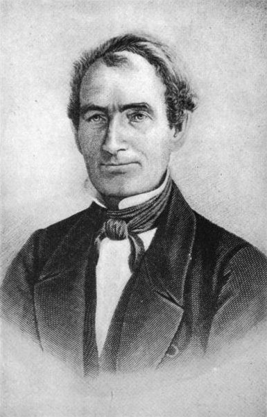

# Models for a single population

```{r, include=FALSE}
source("common_settings.R")
```

**Lesson plan**:

1. We start by discussing what it means to solve an initial-value problem: the solution is an expression that allows us to calculate $x(t)$ for any $t$. A few ecologically-relevant models can be solved explicitly, for example the exponential and logistic growth models.
1. Because, on the other hand, solving differential equations is a laborious process, and in many cases writing the solution is impossible or does not give us any insight on the dynamics, we introduce a graphical model that allows to effortlessly sketch the dyanmics of any first-order ODE (i.e., models with a single equation).
1. This allow us to introduce essential concepts such as the notion of an equilibrium and its stability.
1. We show that determining stability using this graphical method is equivalent to performing stability analysis via linearization around an equilibrium, a method that will be extended to systems of multiple ODEs in the next chapter.
1. We briefly discuss the idea of bifurcation points --- i.e., particular choices of parameters for which the dynamics of the system change qualitatively.
1. We conclude by introducing the idea of Lyapunov functions, allowing us to determine global stability without the need to explicitly solve the model. We will see a lot of these functions when we study larger systems.

## Types of dynamical systems

Dynamical systems describe the change of certain variables, typically in time, space or a combination of the two. They have found applications in all scientific disciplines, and were introduced in ecology and evolutionary biology at the beginning of the twentieth century. 

Broadly, dynamical systems can be divided into **continuous** (described by differential equations), or **discrete** (described by maps, or difference equations) models. Many models for population dynamics can be written as (systems of) first-order ordinary differential equations, i.e. equations containing functions of one (or more) independent variables and their derivatives (typically, with respect to time). 

**Ordinary** means we're not dealing with partial differential equations (used in ecology for example for reaction-diffusion equations, or spatial models). **First-order**, mean that they contain only the first derivative with respect to time. Here we will concentrate on **autonomous** systems, meaning that it they are time-invariant (e.g., coefficients do not change in time). We can write these systems as:

$$
\dfrac{d x(t)}{d t} = f(x(t))
$$

In general, we will examine cases in which $f(x(t))$ is a nonlinear function of $x(t)$. We typically deal with **deterministic** systems, in which randomness plays no role in determining future states. Stochastic differential equations, on the other hand, include random components.

## Initial-value problems

Typically, we would like to track the evolution of the system in time, starting from known initial conditions. For example,

$$
\dfrac{d x(t)}{d t} = f(x(t)), \;\; x(0) = x_0
$$

where the independent variable $t$ denotes time and is considered non-negative. $x(t)$ is the state of the system (e.g., the density of the species) at time $t$, $x(t) \in \mathbb{R}^n$, and the function $f$ models the evolution of the system, mapping $\mathbb{R}^n \to \mathbb{R}^n$. The vector $x_0 = x(0)  \in \mathbb{R}^n$ marks the *initial conditions* of the system.

The simplest and most common case in ecology is that in which $f$ is (infinitely) many times continuously differentiable, a.k.a. *smooth*. If this is the case, then the solution $x(t)$ exists and is unique.

In ecological models, dynamics are invariant with respect to  the non-negative orthant $\mathbb{R}^n_{0+}$, i.e.,  the vector $x(t)$ remains non-negative whenever initialized at non-negative initial conditions $x_0 \in \mathbb{R}^n_{0+}$. The function $f$ is *essentially non-negative* if whenever $x_i = 0$, then $f_i(x) \geq 0$ for all $x \in \mathbb{R}^n_{0+}$. A dynamical system is non-negative only if $f$ is essentially non-negative.

We can solve the (system of) ODE(s) if we can write an explicit equation for $x(t)$ given the parameters and the initial conditions. In practice, we rarely can solve the equations we're interested in.

We can however prove that, if $f(x(t))$ is sufficiently well-behaved (technically, if $f(x)$ is  Lipschitz continuous, for example, if it has bounded derivatives), then the initial-value problem above has a solution, the solution is unique, and depends continuously on the intial conditions and the parameters. This means that if we start the system at any point $x(t)= x_t$, we cannot have multiple trajectories intersecting.

## Solvable model: Exponential growth

:::boxhistory
**History: Pierre-François Verhulst (1804-1849)**

```{r, echo=FALSE,out.width = "25%"}

```

Pierre-François Verhulst was born in 1804 in Brussels, Belgium. In 1835 became professor of mathematics at the newly-instituded Free University of Brussels. 

In 1838, inspired by the work of Malthus and Quetelet, he wrote a *Note on the law of population growth*, where he argued that the geometric progression imagined by Malthus would be unfeasible to sustain. He therefore introduced an *unknown function* that would slow down growth for large populations. *The simplest hypothesis one can make on the form of this function is to suppose that* it is quadratic in the size of the population. He went on to solve what is now known as the "logistic growth" model and contrasted it with data for the growth of populations in various countries.
:::

An model of ecological interest that has an explicit solution is that for the exponential growth:

$$
\dfrac{d x(t)}{dt} = \rho \, x(t), \;\; x(0) = 0
$$

This is a **separable** differential equation, meaning that we can formally write:

$$
\dfrac{1}{x(t)} dx(t) = \rho\, dt
$$
Integrate both sides (the left in $d x(t)$, the right in $dt$):

$$
\begin{aligned}
\int \dfrac{1}{x(t)} d x(t) = \rho \int dt
\end{aligned}
$$

Obtaining ($C_i$ are constants of integration):

$$
\begin{aligned}
\log x(t) + C_1= \rho\, t + C_2\\
\log x(t) = \rho\, t + C_3\\
x(t) = e^{\rho\,t + C_3}\\
x(t) = C_4 e^{\rho\, t}
\end{aligned}
$$

Substituting the initial condition $x(0) = x_0$ we find that $C_4 = x_0$:

$$
x(t) = x_0 e^{\rho\, t}
$$

which is our solution. If we know the value of $\rho$ and the initial density $x_0$, we can directly write the population density $x(t)$ for any $t$.

## Solvable model: Logistic growth

Another model that can be solved explicitly is that of the logistic growth:

$$
\dfrac{d x(t)}{dt} = \rho\, x(t) (1 - \alpha\, x(t)), \;\; x(0) = 0
$$

again, we can separate the equation:

$$
\dfrac{1}{x(t) (1 - \alpha\, x(t))} d x(t) = \rho\,  dt
$$
the r.h.s. is trivial to integrate, but the l.h.s. is trickier. We can transform it into a simpler expression by using partial fractions. We want to write:

$$
\dfrac{1}{x(t) (1 - \alpha\, x(t))} = \dfrac{A}{x(t)} + \dfrac{B}{1 - \alpha\, x(t)}
$$

where $A$ and $B$ are appropriate constants. Multiplying both sides by $x(t) (1 - \alpha\, x(t))$, we obtain:

$$
1 = A (1 - \alpha\, x(t)) + B \, x(t) = A + x(t)\, (B - A\, \alpha)
$$

The l.h.s. does not contain $x(t)$, and therefore we want to set $x(t)\, (B - A\, \alpha) = 0$, choosing $B = A\, \alpha$, and therefore $A = 1$. We can integrate the simpler form:

$$
\int \dfrac{1}{x(t)} \,d x(t) + \int \dfrac{\alpha}{(1 - \alpha\, x(t))}\, d x(t) = \rho\,  dt
$$

obtaining:

$$
\begin{aligned}
\log x(t) - \log (1 - \alpha\, x(t)) = \rho\, t  + C_1\\
\log \dfrac{x(t)}{1 -  \alpha\, x(t)} = \rho\, t  + C_1\\
\dfrac{x(t)}{1 -  \alpha\, x(t)} = e^{\rho\, t + C_1}\\
x(t) = \dfrac{e^{\rho\, t + C_1}}{1 + \alpha\, e^{\rho\, t + C_1}}\\
x(t) = \dfrac{1}{\alpha + e^{-(\rho\, t + C_1)}}
\end{aligned}
$$

To find the value of $C_1$, substitute the initial condition $x(0) = x_0$, and solve for $C_1$:

$$
\begin{aligned}
x_0 = \dfrac{1}{\alpha + e^{-C_1}}\\
C_1 = \log \dfrac{x_0}{1 - \alpha \, x_0}
\end{aligned}
$$

Finally, substituting, we find:

$$
x(t) = \dfrac{x_0 \, e^{\rho\, t}}{1 + \alpha\, x_0 \, (e^{\rho\, t} - 1)}
$$

which provides an explicit solution for this (very simple) model.

:::boxhomework

**Homework**


Find the solution for the logistic growth with harvesting:

$$
\dfrac{d x(t)}{dt} = \rho\, x(t) (1 - \alpha\, x(t)) - \eta\, x(t)
$$
where $1 > \eta > 0$ is the proportion of individuals being harvested.

:::

## Qualitative analysis of models for a single population

Because in general we cannot write an explicit solution for the model, we attempt a qualitative analysis by: a) finding fixed points (equilibria); b) provide a qualitative description of the dynamics; c) probe the stability of fixed points; d) gain an understanding of the system (nature of attractors, changes of behavior for different parameters) without deriving an explicit solution.

When we are dealing with a single population, we can use a graphical method. Simply, plot $dx(t) /dt$ against $x(t)$. We think of $x(t)$ as moving along the $x$ axis, at a velocity determined by the $y$ coordinate. For the exponential growth function:

$$
\dfrac{d x(t)}{dt} = \rho \, x(t)
$$

the graph becomes:

```{r, echo = FALSE}
r <- 0.5 # only makes sense if positive
x <- seq(0, 10, length.out = 100)
dxdt <- r * x
ggplot(tibble(dxdt = dxdt, x = x)) + 
  aes(x = x, y = dxdt) + 
  geom_line(colour = "blue") + 
  geom_hline(yintercept = 0) + 
  geom_vline(xintercept = 0) + 
  geom_point(data = tibble(x = 0, dxdt = 0), size = 3, shape = 1) + 
  annotate("text", x = 7.5, y = 2, label = "+", size = 14) + 
  geom_segment(x = 0.75, xend = 1.75, y = 0.25, yend = 0.25, arrow = myrarrow) + 
  scale_x_continuous("x(t)") + scale_y_continuous("dx(t) / dt") + my_theme
```

The only point where the curve intercepts the $x$ axis is the point $x^\star = 0$. A point $x^\star$ for which $\left . \dfrac{d x(t)}{dt} \right|_{x^\star} = 0$ is an **equilibrium** (or fixed-point) for the system, meaning that if we initialize the system at $x^\star$, it will remain there unless perturbed. Whenever we apply a (small) perturbation to a **stable equilibrium**, the system returns to it; when we perturb an **unstable equilibrium**, on the other hand, the system moves away from it.

Now think of a perturbation: if we were to perturb $x^\star = 0$ by introducing a few individuals, we would find that the population starts growing (i.e., $dx(t) / dt > 0$), meaning that the point is unstable. Thus, using the graphical method introduced above, we can easily identify equilibria (i.e., where the curve intercepts the x-axis), and their stability (i.e., by determining whether the curve around the equilibrium is above or below $d x(t)/dt = 0$).

Next, let's consider the logistic growth equation:

$$
\dfrac{d x(t)}{dt} = \rho\, x(t) (1 - \alpha\, x(t))
$$

We can draw the graph (note the quadratic term---we're describing a parabola):

```{r, echo = FALSE}
r <- 0.5 # only makes sense if positive
x <- seq(0, 1.25, length.out = 100)
dxdt <- r * x * (1 - x)
ggplot(tibble(dxdt = dxdt, x = x)) + 
  aes(x = x, y = dxdt) + 
  geom_line(colour = "blue") + 
  geom_hline(yintercept = 0) + 
  geom_vline(xintercept = 0) + 
  geom_point(data = tibble(x = 0, dxdt = 0), size = 3, shape = 1) + 
  geom_point(data = tibble(x = 1, dxdt = 0), size = 3, shape = 16) + 
  annotate("text", x = 0.5, y = 0.1, label = "+", size = 14) + 
  annotate("text", x = 1.2, y = -0.05, label = "-", size = 16) +
  geom_segment(x = 0.05, xend = 0.15, y = 0.01, yend = 0.01, arrow = myrarrow) +
  geom_segment(x = 0.85, xend = 0.95, y = 0.01, yend = 0.01, arrow = myrarrow) + 
  geom_segment(x = 1.05, xend = 1.15, y = 0.01, yend = 0.01, arrow = mylarrow) + 
  scale_x_continuous("x(t)") + scale_y_continuous("dx(t) / dt") + my_theme
```

Now we have two equilibria, at $x^\star = 0$ and $x^\star = 1 / \alpha$. If we perturb $x^\star = 0$, the system moves away from it (unstable), while if we perturb $x^\star = 1 / \alpha$ the system goes back to it (stable).

:::boxhistory
**History: Warder Clyde Allee (1885-1955)**

```{r, echo=FALSE,out.width = "25%"}
knitr::include_graphics('img/Allee.jpg')
```

Born in Indiana, Allee received his in 1912 PhD from the University of Chicago, where he returned in 1921. He was the Dean in the College of Arts, Literature, and Science (1924-1926) and Secretary of the Department of Zoology (1927-1934). He stayed at U. Chicago until his retirement (1950).

He performed a series of studies on animal aggregation. He found that goldfish would growing in a tank laced with colloidal silver would grow faster when more individuals were present. Today, **Allee effect** applies to populations that grow faster when a certain threshold population is surpassed.
:::


Now a more complex model, in which the population experiences an Allee effect:

$$
\dfrac{d x(t)}{dt} = \rho\, x(t) (x(t) - \gamma) (1 - \alpha\, x(t))
$$

where $0<\gamma<1 / \alpha$. Plotting,

```{r, echo = FALSE}
r <- 0.5 # only makes sense if positive
a <- 0.5 # must be lower than 1
x <- seq(0, 1.1, length.out = 100)
dxdt <- r * x * (x - a) * (1 - x)
ggplot(tibble(dxdt = dxdt, x = x)) + 
  aes(x = x, y = dxdt) + 
  geom_line(colour = "blue") + 
  geom_hline(yintercept = 0) + 
  geom_vline(xintercept = 0) + 
  geom_point(data = tibble(x = 0, dxdt = 0), size = 3, shape = 16) + 
  geom_point(data = tibble(x = a, dxdt = 0), size = 3, shape = 1) + 
  geom_point(data = tibble(x = 1, dxdt = 0), size = 3, shape = 16) + 
  annotate("text", x = 0.22, y = -0.015, label = "-", size = 16) + 
  annotate("text", x = 0.78, y = 0.02, label = "+", size = 14) + 
  annotate("text", x = 1.1, y = -0.015, label = "-", size = 16) +
  geom_segment(x = 0.05, xend = 0.15, y = 0.002, yend = 0.002, arrow = mylarrow) + 
  geom_segment(x = 0.35, xend = 0.45, y = 0.002, yend = 0.002, arrow = mylarrow) + 
  geom_segment(x = 0.55, xend = 0.65, y = 0.002, yend = 0.002, arrow = myrarrow) + 
  geom_segment(x = 0.85, xend = 0.95, y = 0.002, yend = 0.002, arrow = myrarrow) + 
  geom_segment(x = 1.05, xend = 1.15, y = 0.002, yend = 0.002, arrow = mylarrow) + 
  scale_x_continuous("x(t)") + scale_y_continuous("dx(t) / dt") + my_theme
```

In this model, there are two stable equilibria ($x^\star = 0$ and $x^\star = 1  / \alpha$), separated by an unstable equilibrium ($x^\star= \gamma$). Depending on the initial condition, we might end up with either---we call this situation bistability.

Note that bistability makes it clear that we can only apply small perturbations to the equilibrium to probe its stability---for example, imagine being at $x^\star = 1 / \alpha$ and perturbing the population by bringing it below $\gamma$; then we would find that the population goes extinct, suggesting that $x^\star = 1 / \alpha$ is "somewhat unstable".

### Stability using derivatives

You might have noticed in the previous graphs that whenever the curve $dx(t) /dt$ is negative on the left of a point and positive on its right we find that the point is unstable, while conversely a point for which $dx(t) /dt$ is positive on the left and negative on the right is stable. We can formalize this by taking the derivative of $dx(t) /d t$ with respect to $x(t)$, and evaluating this function at different equilibria. 

For example, for the exponential growth model, we have:

$$
\dfrac{\partial}{\partial x} \dfrac{dx}{dt} = \dfrac{\partial f(x)}{\partial x} = \dfrac{\partial (r x)}{\partial x} = \rho
$$
This is always posive when $\rho > 0$, and as such the only equilibrium ($x^\star = 0$) is unstable.

For the logistic growth, we find:

$$
\dfrac{\partial f(x)}{\partial x} = \dfrac{\partial (\rho\, x - \rho\, \alpha\, x^2)}{\partial x}  = \rho - 2 \rho\, \alpha\, x
$$

When we evaluate this function at the equilibrium $x^\star = 0$, we obtain $\rho > 0$, and as such the equilibrium is unstable. Conversely, when we evaluate the fuction at $x^\star = 1 / \alpha$, we obtain $\rho  - 2 \rho \to -\rho$ and therefore the equilibrium is stable.

Finally, for the model with Allee effect, we have:

$$
\dfrac{\partial (\rho\, x (x-\gamma)(1-\alpha\, x))}{\partial x}  = - \rho\, \gamma + 2 \rho\, x(1 + \alpha) - 3 \rho\, \alpha\, x^2
$$
At $x^\star = 0$, we find $-\rho\, \gamma$ which is always negative, and as such $x^\star = 0$ is stable. At $x^\star = \gamma$ we have $\rho\, \gamma\, (1- \gamma\, \alpha)$ which is positive (as $\gamma\, \alpha < 1$) and as such is an unstable equilibrium. Finally, for $x^\star = 1/\alpha$ we have $\rho (\gamma - 1/\alpha)$ which is always negative.

### What are we doing when probing stability using derivatives?

More formally, we can think of describing the dynamics of a perturbation around the equilibrium. Call $\Delta x(0) = x(0) - x^\star$, and approximate the dynamics around the equilibrium. We want to write the dynamics of $\Delta x(t)$. By chain rule, $\frac{d \Delta x(t)}{dt} = \frac{d \Delta x(t)}{d x(t)} \frac{d x(t)}{dt}$, and as such 

$$
\frac{d \Delta x(t)}{dt} = f(\Delta x(t) + x^\star)
$$

If we think of the perturbation as infinitesimally small, we can Taylor expand around $x^\star$:

$$
f(\Delta x(t) + x^\star) = f(x^\star) + \left . \frac{df(x)}{dx} \right |_{x^\star} \Delta x(t) + \frac{1}{2}\left . \frac{d^2 f(x)}{dx^2} \right |_{x^\star} (\Delta x(t))^2 + \ldots
$$

Taking only the linear term, and noticing that $f(x^\star) = 0$ by definition, we have:

$$
\frac{d \Delta x(t)}{dt} \approx \left . \frac{d f(x)}{dx} \right |_{x^\star} \Delta x(t) = \rho\, \Delta x(t)
$$

which is the equation for the exponential growth we have seen above. If $\left . \frac{d f(x)}{d x}\right |_{x^\star} < 0$ the perturbation $\Delta x(t)$ will die out, while if it is positive it will increase fast.

## Bifurcations

The shape of the graphs above might depend on the value of parameters. When a small change in one or several parameters causes a qualitative change in the behavior of the system, we say the system has crossed a **bifurcation** point (the term "bifurcation" was introduced by  Henri Poincaré in 1885). At a bifurcation point, equilibria could disappear or be created, change their stability, the system could start cycling, etc.

In low-dimensional system, there are a variety of different behaviors, each of which has its own name (e.g., saddle-node, pitchfork, transcritical, Hopf, period-doubling, ..., bifurcation). The **codimension** of a bifurcation is the number of parameters we need to change the behavior of the system. Clearly, codimension-1 and -2 bifurcations are the simplest and most studied. 

Here we just show the main idea using a simple example. For a detailed and accessible introduction, see  @strogatz2018nonlinear and @seydel2009practical.

Consider the model:

$$
\dfrac{d x}{dt} = \rho + x^2
$$

The equilibria of the system, when they exist, are given by $x^\star = \pm \sqrt{-\rho}$. It is clear that, when $\rho < 0$ we will have two equilibria, when $\rho = 0$ a single equilibrium $x^\star = 0$, and that when $\rho > 0$ no (real) equilibrium exists. As such, the shape of the diagrams we have sketched above depend on $\rho$. For example, when $\rho = -4$, we have:

```{r, echo = FALSE}
rho <- -4
x <- seq(-5, 5, length.out = 100)
dxdt <- rho + x^2
ggplot(tibble(dxdt = dxdt, x = x)) + 
  aes(x = x, y = dxdt) + 
  geom_line(colour = "blue") + 
  geom_hline(yintercept = 0) + 
  geom_vline(xintercept = 0) + 
  geom_point(data = tibble(x = -2, dxdt = 0), size = 3, shape = 16) + 
  geom_point(data = tibble(x = 2, dxdt = 0), size = 3, shape = 1) + 
  annotate("text", x = -4, y = 3, label = "+", size = 16) + 
  annotate("text", x = 4, y = 3, label = "+", size = 14) + 
  annotate("text", x = -1, y = -1, label = "-", size = 16) +
  annotate("text", x = 1, y = -1, label = "-", size = 16) +
  scale_x_continuous("x(t)") + scale_y_continuous("dx(t) / dt") + my_theme
```

The equilibrium on the left is stable, while the one on the right is unstable. The graph is qualitatively the same for any $\rho < 0$. When $\rho = 0$, however, the two equilibria "collide", and merge into the single "half-stable" equilibrium:

```{r, echo = FALSE}
rho <- 0
x <- seq(-5, 5, length.out = 100)
dxdt <- rho + x^2
ggplot(tibble(dxdt = dxdt, x = x)) + 
  aes(x = x, y = dxdt) + 
  geom_line(colour = "blue") + 
  geom_hline(yintercept = 0) + 
  geom_vline(xintercept = 0) + 
  geom_point(data = tibble(x = -0.05, dxdt = 0), size = 3, shape = 16) + 
  geom_point(data = tibble(x = 0.05, dxdt = 0), size = 3, shape = 1) + 
  annotate("text", x = -4, y = 3, label = "+", size = 16) + 
  annotate("text", x = 4, y = 3, label = "+", size = 14) + 
  scale_x_continuous("x(t)") + scale_y_continuous("dx(t) / dt") + my_theme
```

The equilibrium $x^\star = 0$ is stable if we approach it from the left, while unstable if we are reaching it from the right. When we cross the bifurcation $\rho_c = 0$, the equilibrium disappears altogether, leading to unbounded growth:

```{r, echo = FALSE}
rho <- 0.5
x <- seq(-5, 5, length.out = 100)
dxdt <- rho + x^2
ggplot(tibble(dxdt = dxdt, x = x)) + 
  aes(x = x, y = dxdt) + 
  geom_line(colour = "blue") + 
  geom_hline(yintercept = 0) + 
  geom_vline(xintercept = 0) + 
  annotate("text", x = -4, y = 3, label = "+", size = 16) + 
  annotate("text", x = 4, y = 3, label = "+", size = 14) + 
  scale_x_continuous("x(t)") + scale_y_continuous("dx(t) / dt") + my_theme
```

We can summarize the behavior of the system for different values of $\rho$ in a **bifurcation diagram**: on the x-axis we have the parameter we are varying (in this case $\rho$), and on the y-axis we report $x(t)$, marking the position of all the equilibria, with a solid line indicating stable equilibria and a dashed line the unstable ones:


```{r, echo = FALSE}
rho <- seq(-2, 0, length.out = 300)
ggplot(tibble(rho = rho, xstable = -sqrt(-rho), xunstable = sqrt(-rho))) + 
  aes(x = rho, y = xstable) + 
  geom_line(colour = "blue") + 
  geom_line(aes(x = rho, y = xunstable), linetype = 2, colour = "blue") + 
  geom_hline(yintercept = 0) + 
  geom_vline(xintercept = 0) + 
  scale_y_continuous("x(t)") + my_theme + scale_x_continuous(expression(rho), limits = c(-2, 1))
```

Note that the rate at which the system approaches (moves away from) the stable (unstable) equilibrium depends on $\rho$. When $\rho \ll 0$ the system moves fast, while when $\rho \to \rho_c = 0$ the system moves more slowly. This phenomenon is called "critical slowing down" and has been proposed as a generic indicator that a system is approaching a bifurcation point.

:::boxhomework

**Homework**

Draw the bifurcation diagram for the Allee effect model with harvesting:


$$
\dfrac{d x(t)}{dt} = \rho\, x(t) (1 - \alpha\, x(t)) - \eta\, x(t)
$$
where $1 > \eta > 0$ is the proportion of individuals being harvested.

*Details*

- take $\rho = 1$, $\alpha = 1$ and vary $\eta$ between 0 and 1.
- write code to solve the initial value problem from a random initial condition $x(0) \sim \mathcal U[0, 2]$ (i.e., sampled independently from a uniform distribution between 0 and 2); document the possible outcomes.
- write code to plot the bifurcation diagram---for each value of $\eta$, mark stable and unstable equilibria.
- what is the critical $\eta_c$ where a bifurcation occurs?

:::

A few interesting references on detecting the approaching of a bifurcation in experimental systems:

:::boxpaper
**Key paper: @scheffer2009early**

Starting in the early 2000s, much work went into trying to anticipate dramatic changes in natural and man-made systems (e.g., lakes turning eutrophic, fisheries collapsing). In this review, Scheffer *et al.* summarize previous work and present an accessible introduction to the problem.

**Key paper: @dai2012generic**

Dai *et al.* grew populations of *Saccharomyces cerevisiae* on sucrose. Because sucrose is split outside the cell, it creates an Allee effect: when the population density is high, it is energetically convenient to produce the enzyme to spit the sucrose, as the different cells pool their efforts; when population density is low, the gain is not sufficient to balance the cost. By tuning the mortality (dilution), they were able to experimentally recreate the bifurcation diagram of the exercise above. The data from the experiments are [here](https://doi.org/10.5061/dryad.p2481134).
:::

## Long term behavior of 1-D systems

First-order (i.e., single-equation) ODEs can produce a very limited variety of long-terms behaviors: for $t \to \infty$ we can only have $x(t) \to \pm \infty$ or $x(t) \to x^\star$. For population models, this means that either growth is unbounded (e.g., exponential growth model), or the population will reach an equilibrium point (possibly, out of many).

This is a direct consequence of the uniqueness of trajectories: because we are moving in a 1-dimensional space, the fact that trajectories cannot cross means that if we are at a certain point $x(t) = x_t$, then either $dx(t)/dt >0$, $dx(t)/dt <0$, or $dx(t)/dt =0$, but can take only one value, preventing more complex behaviors such as cycles or chaos.

For smooth functions and autonomous systems, one needs at least two equations to produce cycles and three equations to produce chaos. This is in stark contrast with difference equations---a single, innocent-looking difference equation can give rise to all sorts of dynamics.

:::boxpaper
**Key paper: @may1976simple**

May takes a possible model for the logistic growth in discrete time, and shows how this very simple model can give rise to equilibria, cycles and chaos. This is one of the papers that launched an all-out effort to explore chaotic dynamics that lasted for all of the 1980s.

:::

## Lyapunov functions

While in many cases we cannot write an explicit solution for a (system of) differential equation(s), we might be able to determine the stability of equilibria and their basin of attraction (i.e., the set of initial conditions eventually leading to the equilibrium $x^\star$) by considering functions that change monotonically through the dynamics.

Suppose that $\dfrac{d x(t)}{dt} =f(x(t))$, and that $x^\star$ is an equilibrium. Let $V(x)$ be a function defined in an open set $\mathcal O$ containing $x^\star$, such that a) $V(x^\star) = 0$ and $V(x) > 0$ for any $x \neq x^\star$, and b) $d V /dt \leq 0$ for all $x \in \mathcal O - x^\star$. Then $V$ is a *Lyapunov function* for the model, and $x^\star$ is stable. The Lyapunov function is called *strict*, and the equilibrium $x^\star$ *asymptotically stable* if $d V /dt < 0$.

While Lyapunov functions are great, because we can prove stability without the need to solve the system, there is no general rule to construct such a function. Often, "candidate" Lyapunov functions are available, but the process of finding the right function typically requires a lot of ingenuity and trial and errors.

Fortunately, for system with a single state a quadratic function is guaranteed to solve the problem. Take the model for logistic growth (with $\rho > 0$ and $\alpha > 0$, and the candidate Lyapunov function:

$$
V(x(t)) = (x(t) - x^\star)^2
$$

with $x^\star = 1 / \alpha$. The function is positive for any $x(t) \neq x^\star$. Next, we derive with respect to $t$:

$$
\dfrac{d V(x(t))}{t} = \dfrac{d V(x(t))}{x(t)}\dfrac{d x(t)}{t} = 2 \left(x(t) - \dfrac{1}{\alpha}\right)\rho\, x(t) (1 - \alpha\, x(t))
$$

The derivative is negative whenever $x(t) > 0$ and $x(t) \neq x^\star$:

$$
\dfrac{d V(x(t))}{t} = 2 \rho\, x(t) \left(x(t) - \dfrac{1}{\alpha}\right) (1 - \alpha\, x(t))= -\dfrac{\rho\, x(t)}{\alpha}\left(x(t) - \dfrac{1}{\alpha}\right)^2
$$

and as such $x^\star$ is asymptotically stable. The basin of attraction (i.e., where the Lyapunov function has the desired properties) is $x \in \mathbb{R}_+$. There can be several alternative Lyapunov functions. For example, consider:

$$
V(x(t)) = x(t) - x^\star - x^\star \log \dfrac{x(t)}{x^\star}
$$
which is positive for $x(t) > 0$ and $x(t) \neq x^\star$, taking the derivative w.r.t. time, we find:

$$
\dfrac{d V(x(t))}{t} = \left(1 - \dfrac{x^\star}{x(t)}\right)\rho\, x(t) (1 - \alpha\, x(t)) = -\rho\, x^\star (x(t) - x^\star)^2 
$$
which again is negative whenever $x^\star > 0$, $\rho >0$ and $x(t) \neq x^\star$.

