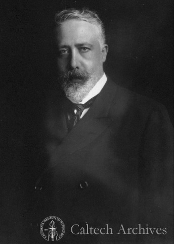

# Models for two populations

```{r, include=FALSE}
source("common_settings.R")
```

**Lesson plan**:

1. We discuss the concepts introduced in the previous chapter in the context of two-dimensional ("planar") systems of differential equation.
1. We summarize important concepts from linear algebra: eigenvalues and eigenvectors, the matrix exponential.
1. We show how these concepts can be used to solve linear systems of differential equations.
1. We introduce the "community matrix", allowing us to determine the local asymptotic stability of equilibria. 
1. We analyze in detail the classic Lotka-Volterra predator-prey model, and a version of the model in which the prey grows logistically.

## Qualitative analysis of models for two populations

In this section, we extend the qualitative analysis we've performed for a single populations to models with two populations. Many of the methods introduced below extend to the case of multiple populations.

### Isoclines of null growth

Take a two-dimensional model. For each equation, we can write the solution of $dx/dt = 0$ as a function of $y$, thereby defining the curve in the $(x, y)$ plane (the "phase plane") for which the growth of species $x$ is zero. For a concrete example, take the classic predator-prey Lotka-Volterra system:

$$
\begin{cases}
\dfrac{d x(t)}{dt} = \rho\, x(t) - \alpha\, x(t)\, y(t)\\
\dfrac{d y(t)}{dt} = -\delta\, y(t)  + \beta\, x(t)\, y(t)
\end{cases}
$$

where $x(t)$ is the density of the prey species at time $t$ and $y(t)$ that of the predator. We can interpret $\rho$ as the intrinsic growth rate of the prey (i.e., the growth when the predator is absent), $\delta$ as the death rate of the predator, and $\alpha$ and $\beta$ as the loss of (gain in) growth due to predation.

:::boxhistory
**History: Alfred J. Lotka (1880-1949)**

```{r, echo=FALSE,out.width = "25%"}
knitr::include_graphics('img/Lotka.jpg')
```

Alfred Lotka was born to French-speaking American parents in Lemberg (then part of the Habsburg empire, now Lviv, Ukraine). He studied in France, Germany and England, receiving a BSc in 1901 and a DSc in 1912 from Birmingham university. He moved to the US in 1902, and worked at the US Patent office, as an editor of Scientific American, and as a statistician at the Metropolitan Life Insturance Company in NYC. He wrote more than a hundred papers and five books, spanning a large range of topics. He's best known for the book *Elements of Physical Biology*, his contributions to demography, and one of the first studies dealing with bibliometrics [@lotka1926frequency]. 

Starting in 1910 (reprinted as @lotka2002contribution) he investigated coupled differential equations relating to chemical as well as ecological dynamics. In @lotka1920analytical he studied a system of two ODEs that gave rise to perpetual oscillations: *"It was, therefore, with considerable surprise that the writer, on applying his method to certain special cases, found these to lead to undamped, and hence indefinitely continued, oscillations."* He went on to describe *"1. A species of organism $S_1$, a plant species, say, deriving its nourishment from a source presented in such large excess that the mass of the source may be considered constant during the period of time with which we are concerned. 2. A species $S_2$, for example a herbivorous animal species, feeding on $S_1$."* 

The equations he had derived (and then studied later in more detail) are now termed Lotka-Volterra equations.

:::

Let's look at a possible trajectory for the system, to gain an intuition of what can happen:

```{r, echo = FALSE}
predator_prey <- function(t, x, parameters){
  with(as.list(c(x, parameters)), {
    dx1dt <- x[1] * (g - a * x[2])
    dx2dt <- x[2] * (-d + b * x[1])
    return(list(c(dx1dt, dx2dt)))
  })
}

# choose parameters and initial conditions
g <- 1
a <- 0.5
d <- 0.4
b <- 0.3
x <- c(1, 2)
# integrate differential equation
out <- ode(y = x, times = seq(0, 10, by = 0.1), 
           func = predator_prey, 
           parms = list(g, a, d, b)) %>% 
  as_tibble() %>% rename(x1 = `1`, x2 = `2`)
pl <- ggplot(out %>% arrange(time), 
             aes(x = x1, y = x2, colour = time)) + 
  geom_point() + geom_path() + my_theme + scale_x_continuous(expression(x(t))) + 
  scale_y_continuous(expression(y(t)))
show(pl)
```

You can see that the population densities, when drawn in the "phase plane" cycle counterclockwise. Let's try to understand why.

The equation for the prey is zero either when $x(t) = 0$ or when $\rho - \alpha\,y(t) = 0$, yielding $y(t) = \rho / \alpha$. Whenever the density of the predator $y(t) < \rho / \alpha$, prey will grow; conversely, whenever $y(t) > \rho / \alpha$, prey will decline. 

Graphically:

```{r, echo = FALSE}
pl + geom_hline(yintercept = g / a, linetype = 2, colour = "red") + 
  annotate("text", x = 1.3, y = 2.2, colour = "red", label = "prey declines") + 
  geom_segment(x = 1.3, xend = 1.5, y = 2.1, yend = 2.1, arrow = mylarrow, colour = "red") + 
  annotate("text", x = 1.3, y = 1.8, colour = "red", label = "prey grows") + 
  geom_segment(x = 1.3, xend = 1.5, y = 1.9, yend = 1.9, arrow = myrarrow, colour = "red")
```

Similarly, the equation for the predator is zero either when $y(t) = 0$ or when $-\delta + \beta\, x(t) = 0$, yielding $x(t) = \delta / \beta$. Whenever the density of the prey $x(t) < \delta / \beta$, predators will decline; conversely, whenever $x(t) > x(t) = \delta / \beta$, predators will grow.

Graphically:

```{r, echo = FALSE}
pl + geom_vline(xintercept = d / b, linetype = 2, colour = "darkgreen") + 
  annotate("text", x = 1.2, y = 2.0, colour = "darkgreen", label = "predator declines") + 
  geom_segment(x = 1.2, xend = 1.2, y = 2.2, yend = 2.1, arrow = myrarrow, colour = "darkgreen") + 
  annotate("text", x = 1.5, y = 2.0, colour = "darkgreen", label = "predator grows") + 
  geom_segment(x = 1.5, xend = 1.5, y = 1.8, yend = 1.9, arrow = myrarrow, colour = "darkgreen")  
```

Now let's put the two graphs together:

```{r, echo = FALSE}
pl + geom_vline(xintercept = d / b, linetype = 2, colour = "darkgreen") + 
  geom_segment(x = 1.2, xend = 1.2, y = 2.2, yend = 2.1, arrow = myrarrow, colour = "darkgreen") +
  geom_segment(x = 1.2, xend = 1.2, y = 1.9, yend = 1.8, arrow = myrarrow, colour = "darkgreen") + 
  geom_segment(x = 1.5, xend = 1.5, y = 1.8, yend = 1.9, arrow = myrarrow, colour = "darkgreen") +
  geom_segment(x = 1.5, xend = 1.5, y = 2.1, yend = 2.2, arrow = myrarrow, colour = "darkgreen") +
  geom_hline(yintercept = g / a, linetype = 2, colour = "red") + 
  geom_segment(x = 1.3, xend = 1.2, y = 2.2, yend = 2.2, arrow = myrarrow, colour = "red") + 
  geom_segment(x = 1.5, xend = 1.4, y = 2.2, yend = 2.2, arrow = myrarrow, colour = "red") + 
  geom_segment(x = 1.3, xend = 1.2, y = 1.8, yend = 1.8, arrow = mylarrow, colour = "red") + 
  geom_segment(x = 1.5, xend = 1.4, y = 1.8, yend = 1.8, arrow = mylarrow, colour = "red") +
  geom_point(x = d/b, y = g/a, colour = "black", shape = 1, size = 2) + 
  geom_point(x = 0, y = 0, colour = "black", shape = 1, size = 2)
```

Clearly, a possible equilibrium of the system is $(x^\star, y^\star)^T = (0, 0)^T$ (often called the "trivial" equilibrium). You can see that there is another equilibrium where the two isoclines meet $(x^\star, y^\star)^T = (\delta / \beta, \rho / \alpha)^T$, and that the dynamics will tend to cycle around the equilibrium.

But how do we know whether dynamics will cycle toward the equilibrium, spiral away from it, or describe closed orbits? To answer this question, we can try to extend our linear analysis by Taylor-expanding the dynamics around the equilibrium.

## Local stability analysis

Suppose that a feasible (i.e., positive) equilibrium $x^\star$ exists for a given model. Then we can ask whether it is **attractive**, i.e. if trajectories started at initial condition $x(0)$ will eventually reach $x^\star$. This problem is in general difficult to solve (but see below); as an alternative, we can test for **local asymptotic stability**, i.e., ask whether **the system will return to the equilibrium if perturbed infinitesimally away from it**. In general, whenever we describe an ecological community as a system of nonlinear, autonomous ODEs:

$$
\frac{d x_i (t)}{d t} = f_i (x(t)) \;,
$$

we define an equilibrium $x^\star$ as a vector of densities such that:

$$
\left. \frac{d x_i}{d t} \right|_{{x}^\star} = f_i
({x}^\star) = 0 \quad \forall i
$$

A given system might have a multitude of equilibria. When the system is resting at an equilibrium point, it will remain there unless it is perturbed away from it. Local stability analysis is a method to probe whether a system that is perturbed infinitesimally away from an equilibrium will eventually return to it, or rather move away from it. 

:::boxmath

**Taylor series**

*Single-variable*: suppose function $f$ infinitely differentiable around a point $x = a$. Then 

$$
f(x) = \sum_{k = 0}^\infty \dfrac{D^{k} f(a)}{k!} (x-a)^k = f(a) + \left. \dfrac{d f}{d x} \right|_{a} (x-a)+ \dfrac{1}{2}\left. \dfrac{d^2 f}{d x^2} \right|_{a} (x-a)^2 + \cdots
$$

where $D^{k} f(a)$ is the $k$-th derivative of $f(x)$ w.r.t. $x$, evaluated at $a$.

*Vector-valued functions*: now $f(x)$ is a vector-valued function, and $x$ a vector. To expand around the point $a$, we need to define the Jacobian matrix

$$
J = Df(x)
$$

with elements:

$$
J_{ij} = \dfrac{\partial f_i({x})}{\partial x_j} 
$$

Next, we define the Hessian tensor (in this case, a three-dimensional tensor):

$$
H_{ijk} = \dfrac{\partial^2 f_i(x)}{\partial x_j\, \partial x_k}
$$

It is convenient to write the Taylor expansion in component form:

$$
f_i(x) \approx f_i(a) + \sum_j \left . J_{ij} \right|_{a} (x_j - a_j) +\dfrac{1}{2} \sum_j \sum_k \left. H_{ijk} \right|_a (x_j-a_j)(x_k-a_k)
$$

*Example*

Consider the vector-valued function:

$$
f(x) = \begin{pmatrix}
x_1^3 + 2 x_2^2\\
x_1 - x_2^3
\end{pmatrix}
$$

Approximate the function around a generic point $a = (a_1,a_2)^T$. The Jacobian is:

$$
J = \begin{pmatrix}
3 x_1^2 & 4 x_2\\
1 & -3 x_2^2
\end{pmatrix}
$$

and the two slices of the Hessian tensor are:

$$
H_1 = \begin{pmatrix}
6 x_1 & 0 \\
0 & 4
\end{pmatrix}
$$

and 

$$
H_2 = \begin{pmatrix}
0 & 0 \\
0 & -6 x_2
\end{pmatrix}
$$

as such:

$$
f(x) \approx \begin{pmatrix}
a_1^3 + 2a_2^2 + 3 a_1^2 (x_1 - a_1)+ 4 a_2 (x_2-a_2) + 3 a_1 (x1-a_1)^2 + 2 (x_2 - a2)^2\\
a_1 - a_2^3+x_1-a_1-3 a_2^2 (x_2-a_2)-3 a_2 (x_2 - a_2)^2
\end{pmatrix} 
$$

For example, expanding around $a = (0, 0)^T$, we obtain:

$$
f(x) \approx \begin{pmatrix}
2 x_2^2\\
x_1
\end{pmatrix}
$$

while around $a = (2, 1)^T$, we find:

$$
f(x) \approx \begin{pmatrix}
2 (x_2^2 + 3 x_1 (x_1-2) + 4)\\
x_1 + 3 x_2(x_2 - 3) + 5
\end{pmatrix}
$$

Note that considering the first two terms of the Taylor expansion results in second-degree polynomials; adding a cubic terms would in general yield a better approximation, etc. 

:::

Suppose that a system is resting at an equilibrium $x^\star$, and that it is slightly perturbed away from it. $\Delta x(0) = x(0)-x^\star$ is the state of the system immediately after the perturbation. Taylor-expanding around $x^\star$ and taking only the linear term, we have:

$$
f(\Delta x(0)) = f(x^\star)+ \left. J \right|_{x^\star} \Delta x(0) = \left. J \right|_{x^\star} \Delta x(0)
$$

Where $J$ is the Jacobian matrix of the system, whose elements are defined as:

$$
J_{ij} = \frac{\partial f_i({x})}{\partial x_j} 
$$

Each element of this matrix is therefore a function, whose value depends on $x$. When we evaluate the Jacobian matrix at an equilibrium point $x^\star$, we obtain the so-called "community matrix" $M$:

$$
  M = \left. {J} \right|_{ {x}^\star}
$$

Note that, although each system has a unique Jacobian matrix, there are as many community matrices as there are equilibria. The community matrix details the effect of increasing the density of one species on any other species around the equilibrium point.

We can therefore write the differential equation:

$$
\frac{d \Delta x(t)}{dt} \approx M \Delta x(t)
$$

which is a system of linear differential equations---i.e., the simplest type of system of ODEs, which can be solved in full generality. 

To solve the system, we need to recap a few important concepts from linear algebra.

:::boxmath

**Eigenvalues and eigenvectors**

For a matrix $M$, we have that if $M v = \lambda v$ with $v$ different from the zero vector, then $\lambda$ is an eigenvalue and $v$ the corresponding eigenvector. Practically, you can think of a matrix as an operator that turns a vector into another vector. If the resulting vector is a rescaled version of the initial vector, then you've found an eigenvector of the matrix, and the rescaling factor is the associated eigenvalue.

For example, show that $(1, 1)^t$ is an eigenvector of the matrix:

$$
A = 
\begin{pmatrix}
1 + a & 1-a\\
2a + 2 & -2a
\end{pmatrix}
$$

We have:

$$
Av = \begin{pmatrix}
(1 + a) v_1 + (1-a) v_2\\
(2a + 2) v_1 - 2a v_2 
\end{pmatrix}
$$

if $v = (1, 1)^t$, we have:

$$
Av = \begin{pmatrix}
2\\
2 
\end{pmatrix} = 2\, v
$$

and as such $v$ is an eigenvector of $M$, with associated eigenvalue $\lambda = 2$.

**Finding eigenvalues**

The eigenvalues of a matrix $M$ are the roots (zeros) of the chacteristic polynomial:

$$
p(\lambda) = \det(\lambda I - M) = 0
$$

Where does this equation come from? We write:

$$
\begin{aligned}
A v = \lambda v\\
\lambda v - Av = 0\\
(\lambda I - A)v = 0
\end{aligned}
$$

if $v$ is nonzero, then the matrix $\lambda I - A$ must be singular (i.e., have at least one eigenvalue equal to zero). Because the determinant is the product of the eigenvalues, then the determinant must also be zero. 

For a $2 \times 2$ matrix, we have:

$$
\begin{aligned}
\det \begin{pmatrix}
\lambda - a_{11} & -a_{12}\\
-a_{21} & \lambda -a_{22}
\end{pmatrix} &= (\lambda - a_{11}) (\lambda - a_{22}) - a_{12} a_{21}\\
&= \lambda^2 - \lambda (a_{11} + a_{22}) + a_{11} a_{22} -  a_{12} a_{21}
\end{aligned}
$$

More compactly,

$$
p(\lambda) = \lambda^2 - \lambda\, \text{tr}(A) + \det(A)
$$

where $\text{tr}(M) = \sum_i M_{ii} = \sum_i \lambda_i$, and $\det(M) = \prod_i \lambda_i$. We therefore find:

$$
\lambda = \frac{\text{tr}(M) \pm \sqrt{(\text{tr}(M))^2 - 4 \det(M)}}{2}
$$
Find the eigenvalues for the matrix $A$ above:

$$
\begin{aligned}
\lambda &= \frac{1-a \pm \sqrt{(1-a)^2+8(1+a)}}{2}\\
&= \frac{1-a \pm \sqrt{(1+a^2 -2 a + 8 a + 8)}}{2} \\
&= \frac{1-a \pm (a+ 3)}{2}
\end{aligned}
$$

The eigenvalues are therefore $\lambda_1 = 2$ and $\lambda_2 = -(1+a)$.

**Facts about eigenvalues and eigenvectors**

Given a matrix $A$, of size $n \times n$, a complex number $\lambda$ is an eigenvalue of $A$ if there is a nonzero (complex) vector $v$ such that $A v = \lambda v$. The vector $v$ is called the eigenvector of $A$ associated with $\lambda$. Note that eigenvectors are defined up to multiplication: if $v$ is an eigenvector, then $\alpha\, v$, with $\alpha$ real is also an eigenvector. Often, we choose $v$ such that its norm $\sqrt{\sum_i v_i^2} = 1$ (called "unit" eigenvector).

A matrix of size $n$ has at most $n$ distinct eigenvalues. If all eigenvalues are distinct then the eigenvectors are linearly independent. This means that if we build the matrix $V = (v_1, v_2, \ldots, v_n)$, then $V$ is invertible. 

Because of the fact above, and diagonalizable matrix (e.g., a sufficient condition is to have all eigenvalues distinct), then we can write:

$$
A = V \Lambda V^{-1}
$$

where $V$ is the matrix of eigenvectors, and $\Lambda$ a diagonal matrix with the eigenvalues of $A$ on the diagonal. As such, $V^{-1} A V = \Lambda$. This is a "similarity transformation", meaning that the eigenvalues of $A$ and $\Lambda$ are (obviously) the same.

If the matrix $A$ contains only real numbers (as always the case in population models), then the eigenvalues of $A$ are either real, or form pairs of complex conjugate eigenvalues of form $\alpha \pm i\, \beta$. This means for example that all odd-sized real matrices have at least one real eigenvalue. If $A$ is real and symmetric, all eigenvalues are real, and all eigenvectors are orthogonal. A diagonal matrix $A$ has eigenvalues $\lambda_i = A_{ii}$

If $A$ has eigenvalues $\lambda$, $B = \beta\, A$ has eigenvalues $\beta\, \lambda$, and $C = A + \gamma\, I$ has eigenvalues $\lambda + \gamma$. The eigenvalues of $A^2 = A \times A$ are $\lambda^2$, and the eigenvalues of $A^{-1}$ are $\lambda^{-1}$. The eigenvalues of $A^T$ are the same as those of $A$ (but the eigenvectors are not the same in general). $A + A^T$ (this matrix is symmetric) has only real eigenvalues, and $A - A^T$ (this matrix is skew-symmetric) has purely imaginary eigenvalues.

A matrix is positive definite if all its eigenvalues are real and positive. It is positive semi-definite if eigenvalues can be zero. The matrices $AA^T$ and $A^T A$ are positive semi-definite, and have the same eigenvalues up to some zeros (used in PCA). Correlation and covariance matrices have these forms.

A matrix with all positive entries has a unique largest real eigenvalue with a corresponding eigenvector that can be chosen to have strictly positive components (Perron-Frobenius). A matrix with constant row sums $\theta$ has $\theta$ as the largest eigenvalue, and $v = 1$ as the corresponding eigenvector (e.g., Markov Chains).

:::

:::boxhomework

**Homework**

Show that a matrix $A$ with sign-pattern:

$$
S(A) = \begin{pmatrix}
- & +\\
- & 0
\end{pmatrix}
$$

has eigenvalues with negative real part. When a matrix is stable due to its sign-pattern (rather than specific values of the coefficients), it is called *qualitatively stable*.

:::

:::boxpaper

**Key paper: @may1973qualitative**

The idea of "sign-stability" was first introduced in economics. May borrowed the idea to analyze simple food webs. Analysis of ecological models based on sign (rather than magnitude) of coefficients was further developed by Richard Levins and collaborators. A good modern summary, along with a few new results, are provided by @dambacher2003qualitative.

:::


We can now analyze systems of linear ODEs.

:::boxmath

**Solution of linear systems of ODEs**

*Matrix exponential*

In analogy with the power series

$$
e^x = \sum_{n=0}^{\infty} \dfrac{x^n}{n!} = 1 + x + \dfrac{x^2}{2} + \dfrac{x^3}{6} + \dfrac{x^4}{24} + \ldots
$$

we define the matrix exponential

$$
e^X = \sum_{n=0}^{\infty} \dfrac{1}{n!}X^n = I + X + \dfrac{1}{2}X^2 + \dfrac{1}{6}X^3 + \dfrac{1}{24}X^4 + \ldots
$$

where $X^2 = X \times X$ and so on. 

*Solution of systems of linear ODEs*

This allows us to solve the system of linear differential equations

$$
\dfrac{d x(t)}{dt}  = A x(t)
$$

with $x(0) = x_0$. When the determinant of $A$, $\det A \neq 0$, the only equilibrium of the system is $x^\star = 0$. If $\det A = 0$ (and $A \neq 0$), on the other hand, there are infinitely many equilibria, all belonging to the same line (in 2-d). By writing the solution we can determine whether trajectories will approach or move away from an equilibrium. We write the solution as:

$$
x(t) = e^{A t} x_0
$$

Importantly, we have that, if $A$ is diagonalizable, 

$$
e^{A t} = V e^{\Lambda t}V^{-1}
$$

where $\Lambda$ is the diagonal matrix containing the eigenvalues of $A$. Because $\Lambda$ is diagonal, we can solve the exponential explicitly:

$$
e^{\Lambda t} = \begin{pmatrix}e^{\lambda_{1}t} & 0 & \ldots & 0\\0& e^{\lambda_{2}t} & \ldots & 0\\\vdots & \vdots & \ddots & \vdots \\0& 0& \ldots & e^{\lambda_{n}t}
\end{pmatrix}
$$

Now we want to study the dynamics of the system. To keep the complexity to a minimum, we define $y(t) = V^{-1} x(t)$, meaning that we are choosing the most appropriate coordinates to study our trajectories. Our equation becomes:

$$
\begin{aligned}
x(t) &= V e^{\Lambda t} V^{-1} x_0\\
V^{-1}x(t) &= V^{-1}V e^{\Lambda t} V^{-1} x_0\\
y(t) = e^{\Lambda t} y_0
\end{aligned}
$$

And therefore $y_j(t) = e^{(\lambda_j)t} y_j(0)$. Clealry, if all $\lambda_j$ are real and negative, the trajectories will die out, and the origin $y^\star = 0$ will be stable. Similarly, if any eigenvalue is real and positive, then the perturbation will amplify in at least one direction. Next, we consider $\lambda_j$ to be complex. In this case, $\lambda_j = \alpha + i\, \beta$. Using Euler's formula, we have

$$
y_j(t) = y_j(0)\, e^{(\alpha + i\, \beta) t} = y_j(0)\, e^{\alpha\, t} (\cos(\beta\, t) + i \sin(\beta\, t))
$$

As such, the solution will oscillate, with damped oscillations whenever $a < 0$ and increasing oscillations when $a > 0$. For example, a case of damped oscillations:

```{r,echo=FALSE}
x0 <- c(0.01, 1) # initial state
# matrix yielding complex eigenvalues
A <- matrix(c(-0.1, 1, -0.99, 0), 2, 2, byrow = TRUE) 
# find eigenvectors and eigenvalues
V <- eigen(A)$vectors
Lambda <- eigen(A)$values
# transform
y0 <- solve(V) %*% x0
t <- seq(0, 40, length.out = 200)
yt1 <- y0[1] * exp(Re(Lambda[1]) * t) * (cos(Im(Lambda[1]) * t) + 1i * sin(Im(Lambda[1]) * t))
yt2 <- y0[2] * exp(Re(Lambda[2]) * t) * (cos(Im(Lambda[2]) * t) + 1i * sin(Im(Lambda[2]) * t))
# transform back to plot xt
xt <- V %*% rbind(yt1, yt2)
ggplot(data = tibble(t = t, x = Re(xt[2,]))) + aes(x = t, y = x) + geom_line() + scale_y_continuous("x(t)") + scale_x_continuous("t") + my_theme
```

and of increasing oscillations:

```{r,echo=FALSE}
x0 <- c(0.01, 1) # initial state
# matrix yielding complex eigenvalues
A <- matrix(c(+0.1, 1, -0.99, 0), 2, 2, byrow = TRUE) 
# find eigenvectors and eigenvalues
V <- eigen(A)$vectors
Lambda <- eigen(A)$values
# transform
y0 <- solve(V) %*% x0
t <- seq(0, 40, length.out = 200)
yt1 <- y0[1] * exp(Re(Lambda[1]) * t) * (cos(Im(Lambda[1]) * t) + 1i * sin(Im(Lambda[1]) * t))
yt2 <- y0[2] * exp(Re(Lambda[2]) * t) * (cos(Im(Lambda[2]) * t) + 1i * sin(Im(Lambda[2]) * t))
# transform back to plot xt
xt <- V %*% rbind(yt1, yt2)
ggplot(data = tibble(t = t, x = Re(xt[2,]))) + aes(x = t, y = x) + geom_line() + scale_y_continuous("x(t)") + scale_x_continuous("t") + my_theme
```

In fact, all the possible trajectories in planar systems can be classified using only the determinant (product of eigenvalues) and the trace (sum of the eigenvalues) of the matrix $A$:


```{r, echo=FALSE,out.width = "95%"}
knitr::include_graphics('img/phase.jpg')
```
:::

Now we can solve the system of ODEs:

$$
\frac{d \Delta x(t)}{dt} \approx M \Delta x(t)
$$

obtaining:

$$
\Delta x(t) = \Delta x(0) e^{Mt} = \Delta x(0) Q e^{\Lambda t} Q^{-1}
$$

Where $Q$ is the matrix containing the (unit) eigenvectors of $M$, and $\Lambda$ is a diagonal matrix containing the eigenvalues of $M$. As such, the eigenvalues of $M$ determine the stability of the equilibrium ${x}^\star$: if all the eigenvalues have negative real part, then the system will eventually return to the equilibrium after sufficiently small perturbations; conversely, if any of the eigenvalues have positive real part, the system will move away from the equilibrium whenever perturbed. Therefore, depending on the sign of the "rightmost" eigenvalue of ${M}$, $\lambda_1$, we can determine the stability of ${x}^\star$:

$$
  \text{Re}(\lambda_1) \begin{cases}
    < 0 \to {x}^\star \quad \text{is stable}\\
    > 0 \to {x}^\star \quad \text{is unstable}
  \end{cases}
$$

## Stability analysis of the Lotka-Volterra Predator-Prey model

We still haven't figured out whether the coexistence equilibrium for the model

$$
\begin{cases}
\dfrac{d x(t)}{dt} = \rho\, x(t) - \alpha\, x(t)\, y(t)\\
\dfrac{d y(t)}{dt} = -\delta\, y(t)  + \beta\, x(t)\, y(t)
\end{cases}
$$

is stable or not. The Jacobian becomes:

$$
J = 
\begin{pmatrix}
\rho - \alpha\, y & -\alpha\, x\\
\beta\, y & -\delta + \beta\, x
\end{pmatrix} 
$$

The community matrix for the equilibrium $(x^\star, y^\star)^T = (0, 0)^T$ is:

$$
M_0 = \left . J \right|_{(0, 0)^T} = \begin{pmatrix}
\rho & 0\\
0 & -\delta 
\end{pmatrix} 
$$

which has eigenvalues $\rho > 0$ amd $-\delta < 0$ --- the equilibrium is unstable. The coexistence equilibrium $(x^\star, y^\star)^T = (\delta / \beta, \rho / \alpha)^T$ yields the community matrix:

$$
M_c = \left . J \right|_{(\delta / \beta, \rho / \alpha)^T} = \begin{pmatrix}
0 & \dfrac{\alpha\, \delta}{\beta} \\
-\dfrac{\beta\, \rho}{\alpha} & 0
\end{pmatrix} 
$$

which has purely imaginary eigenvalues $\lambda = \pm i \sqrt{\rho \, \delta}$. As such the equilibrium is not attractive nor unstable. In fact, Lotka and Volterra were (independently) able to prove that the system cycles neutrally around the equilibrium.

:::boxhistory

**Vito Volterra (1860-1940)**

```{r, volterra, echo=FALSE,out.width = "25%"}
# All defaults

```

Vito Volterra was born in Ancona (then part of the Papal State) in a poor jewish family. The financial situation precipitated with the death of his father, when Vito was two. Vito and his mother went to live with relatives in Turin and then Florence. Volterra showed amazing mathematical talent at a very young age. Antonio Roiti, professor of physics in Florence, noticed the budding mathematician and hired him as his assistant, so that he could continue his studies. He went on to enroll at the Scuola Normale in Pisa, receiving a degree in Physics in 1882. At age 23 he was made full professor of Rational Mechanics in Pisa, and then in 1900 of Mathematical Physics in Rome. For thirty years, he contributed important studies in mathematics, and enriched academic life in Italy (for example, he was the first director of the National Center for Research). In 1931 he refused to take an oath of loyalty to the fascist regime (only 12 professors out of 1250 refused), and was therefore forced to resign (his take on the fascist enterprise: *"Empires die, but Euclid's theorems keep their youth forever"*). 

His interest in mathematical ecology is due to Umberto D'Ancona (his son-in-law), who had studied the trends in fisheries in the Adriatic sea before and immediately after WWI. In 1914-1918 fisheries in the Adriatic had stopped completely because of the conflict. D'Ancona had noticed that, while herbivorous fish had remained about constant, the piscivorous fish had increased dramatically in numbers. The problem piqued Volterra who immediately published a sophisticated study, proposing the same equations studied by Lotka. In a short letter to Nature [@volterra1926fluctuations], he stated the so-called "Volterra's Effect" (which he termed "Law III"): *"a complete closure of the fishery was a form of 'protection' under which the voracious fishes were much the better and prospered accordingly, but the ordinary food-fishes, on which these are accustomed to prey, were worse off than before."* This brief paper was a summary of a much more extensive article [@volterra1926variazioni].

*Lotka-Volterra interactions*

In 1927, Lotka wrote to Nature to raise the issue that the equations studied by Volterra and the figures presented in Volterra's brief article were identical to those found in *Elements of Physical Biology* (published in 1925). He concluded: *"It would be gratifying if Prof. Volterra's publication should direct attention to a field and method of inquiry which apparently has hitherto passed almost unnoticed."*

Volterra graciously conceded *"I recognize his priority, and am sorry not to have known his work, and therefore not have been able to mention it."* He however listed a few points in which the two authors had pursued different directions, and concluded *"Working independently the one from the other, we have found some common results, and this confirms the exactitude and the interest in the position of the problem. I agree with him in his conclusions that these studies and these methods of research deserve to receive greated attention from scholars, and should give rise to important applications."*

:::

### Constant of motion for Lotka-Volterra Predator-Prey 

Volterra wrote:

$$
\dfrac{d x(t)}{d y(t)} = \dfrac{\rho\, x(t) - \alpha\, x(t)\, y(t)}{-\delta\, y(t)  + \beta\, x(t)\, y(t)}
$$

As such:

$$
(-\delta\, y  + \beta\, x\, y)\, d x = (\rho\, x - \alpha\, x\, y)\, d y
$$

dividing both sides by $x\, y$, we obtain:

$$
\left(-\dfrac{\delta}{x}  + \beta \right)\, d x = \left(\dfrac{\rho}{y} - \alpha \right)\, d y
$$

Integrating both sides:

$$
\beta\, x - \delta\, \log x = - \alpha\, y + \rho\, \log y + C
$$

where $C$ is a constant of integration. Rearranging, and substituting $x^\star = \delta / \beta$ and $y^\star =  \rho / \alpha$, we obtain:

$$
\beta (x - x^\star \log x) + \alpha (y - y^\star \log y) = C
$$

This means that the system has a constant of motion (a.k.a. "first integral"): the value of $C$ depends on the initial conditions, and then the system will cycle around the equilibrium in closed orbits.

Note that this quantity works as a Lyapunov function: 

$$
V(x,y) = \beta (x - x^\star \log x) + \alpha (y - y^\star \log y)
$$

$$
\dfrac{d V(x,y)}{dt} = \left(\beta - \dfrac{\delta}{x} \right) \dfrac{dx}{dt}+\left(\alpha - \dfrac{\rho}{y} \right) \dfrac{dy}{dt} = 0
$$

As such, the dynamics are such that $V(x,y)$ remains constant.

### Analysis of Predator-Prey model with logistic growth for the prey

In the classic Lotka-Volterra model, the local stability analysis of the coexistence equilibrium is inconclusive. When however the prey grows logistically it is easy to show that the equilibrium is now stable. For example, consider the system 

$$
\begin{cases}
\dfrac{dx}{dt} = x (1 - x/2 -y)\\
\dfrac{dy}{dt} = y (x - 1)
\end{cases}
$$

First, we find the equilibria. From the first equation, we have $x^\star = 0$, or $y^\star = 1 - x^\star /2$; from the second equation, we have $y^\star = 0$ or $x^\star = 1$. Combining them, we find that either $(x^\star, y^\star) = (0, 0)$ (trival), $(x^\star, y^\star) = (2, 0)$ (boundary), or $(x^\star, y^\star) = (1, 1/2)$ (coexistence). 

The isoclines of zero growth are $y = 1 - x/2$ for the prey, and $x = 1$ for the predator. The Jacobian for the system is

$$
J = \begin{pmatrix}
1 - x - y & -x\\
y & x -1
\end{pmatrix}
$$

At the equilibrium $(x^\star, y^\star) = (1, 1/2)$, we have:

$$
M = \begin{pmatrix}
- \frac{1}{2} & -1\\
\frac{1}{2} & 0
\end{pmatrix}
$$

The trace is $-1/2$ and the determinant $1/2$, as such the equilibrium is stable. The eigenvalues are given by:

$$
p(\lambda) = \lambda^2 + \frac{1}{2} \lambda + \frac{1}{2}
$$

Obtaining:

$$
\lambda = \dfrac{-\frac{1}{2} \pm \sqrt{\frac{1}{4} - 2}}{2} = \dfrac{-1 \pm i \sqrt{7}}{4}
$$

And as such small perturbations will oscillate back to equilibrium. Numerically:

```{r, echo = FALSE}
library(deSolve)
library(tidyverse)
glv <- function(t, x, parameters){
  with(as.list(c(x, parameters)), {
    x[x < 10^-8] <- 0 # numerical stability
    dxdt <- x * (r + A %*% x)
    return(list(dxdt))
  })
}

# choose parameters and initial conditions
r <- c(1, -1)
A <- matrix(c(-1/2, -1, 1, 0), 2, 2, byrow = TRUE)
x0 <- c(0.8, 1.2)
# integrate differential equation
out <- ode(y = x0, times = seq(0, 20, by = 0.1), 
           func = glv, 
           parms = list(r = r, A = A)) %>% 
  as_tibble() %>% rename(x1 = `1`, x2 = `2`)
pl <- ggplot(out %>% arrange(time), 
             aes(x = x1, y = x2, colour = time)) + 
  geom_point() + geom_path() + 
  xlab("x(t)") + ylab("y(t)") + 
  geom_abline(slope = -1/2, intercept = 1, colour = "darkgreen") + 
  geom_vline(xintercept = 1, colour = "darkred") + my_theme + scale_x_continuous(expression(x(t))) + 
  scale_y_continuous(expression(y(t)))
show(pl)
```

#### Global stability

We can write a Lyapunov function for the system above. Take:

$$
V(x,y) = \left(x - x^\star - x^\star \log \dfrac{x}{x^\star} \right) + 
\left(y - y^\star - y^\star \log \dfrac{y}{y^\star} \right) = (x - 1 - \log x) + \left(y - \dfrac{1}{2} - \dfrac{1}{2} \log 2y \right)
$$

Derive with respect to time to obtain:

$$
\dfrac{d V(x,y)}{dt} = -\dfrac{1}{2}(1-x)^2 < 0
$$

As such, the equilibrium $(x^\star, y^\star) = (1, 1/2)$ is globally stable. 

:::boxhomework

**Homework**

Take the competitive Lotka-Volterra model:

$$
\dfrac{dx}{dt} = D(x) (r - Ax)
$$

with the coefficients of $r = (r_1, r_2)^T$ and $A$ all positive. Discuss the existence of a coexistence equilibrium and its stability. Write a Lyapunov function for the case in which $A_{11} = A_{22} > A_{12} = A_{21}$.

:::

