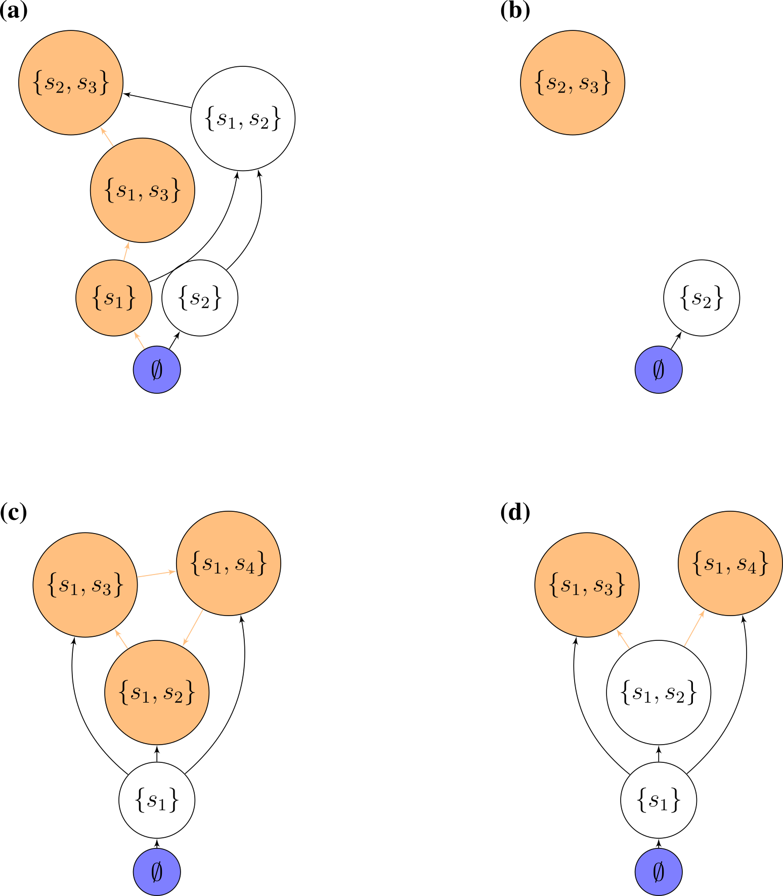

# Ecological assembly

**Lesson plan**:

1. We have seen in the previous lecture that a large ecological community will almost invariably be unstable, possibly leading to extinctions. It is therefore natural to ask what happens when either a feasible equilibrium does not exist, or it is unstable. In particular, we want to know how many species can persist.
1. We discuss the problem of assembly, and why is it so challenging to study analytically. 
1. We introduce a few assumptions that make the problem tractable and at the same time non trivial.
1. We compute how many species will coexist in a GLV with random parameters, and see how we can study assembly by drawing an "assembly graph"

## Assembly

We call **ecological assembly** the process by which **ecological communities are built** by the interplay of invasions (increasing community "richness") and extinctions (decreasing it). The typical setting for an assembly model is one in which a large (possibly infinite) pool of species are available (e.g., in a "mainland"), and every so often individuals from the species' pool enter a local habitat (island, patch, etc.), at which point they might either grow (invasion, establishment, etc.), or go extinct. In either case, the local community might respond to the invader---for example, the invader could send some of the local populations extinct, or shift the community from one state to another.

Historically, this type of island-mainland models (based on species) have been contrasted with "trait-environment" models, in which species' traits, rather than identity are the focus of the dynamics. In such models, ideas such as "environmental filtering" (i.e., the pruning of species that cannot grow in the local environment) and "trait underdispersion" (i.e., the fact that the filtering imposed by the environment results in a convergence in traits) arise naturally. When thinking of communities of competitors (e.g., different species of plants), then we might think that species' interactions will also play a role---because species need to be different enough to coexist, this would generate "trait overdispersion" (due to limiting similarity). For a very opinionated summary of 25 years of discussions on these themes (1975-2000), see @weiher2001ecological (but first read the review @gotelli1999communities, stating that the language and tone of the introduction is "an embarrassment to the discipline").

The idea of assembly was first introduced in ecology by the pioneers of "succession". For example, in 1899 Henry Chandler Cowles studied the vegetation development in the Indiana Dunes---sand dunes are first colonized by "pioneer" species of plants, which are then overgrown by different vegetation in older dunes. Because dunes are regularly disrupted by wind, one could make a "space-for-time" substitution and reconstruct the development of the vegetation as a "chronosequence". Importantly, Cowles (and then Clements) held the view that succession would be a strongly ordered, "determinisitc" process by which communities tended to a certain "climax" state. In the 1920s, Henry Gleason challenged this view, advocating for a much greater role for chance.

#### BIO OF COWLES

Another important piece of the puzzle was provided by the work of Jared Diamond who, while studying avian assemblages in New Guinea, proposed that certain species assemblages would be "forbidden" (due to competition)---by observing several instances of assembly (in the different islands), one could guess the rules of the assembly game (@diamond1975assembly). Diamond's work sparked decades of intense debate, bringing a focus on the role of null models in ecology (are the observed patterns due to chance or necessity?), with especially cogent critiques brought forward by Simberloff, Connor and Gotelli (see for example @gotelli1996null). 

:::boxhistory

**Evelyn Chrystalla "E.C." Pielou (1924-2016)**

```{r, pielou, echo=FALSE,out.width = "35%"}
# All defaults
knitr::include_graphics("img/Chris_Pielou.png")
```

Born in England, and developing her career in Canada, she was one of the first women in mathematical ecology. She studied radio-physics at the University of London, receiving her certificate at 18 years old. She went on to work in the Navy during WWII---meeting, and subsequently marrying a biologist. This fact changed the course of her career---having completed a Bachelor's degree in Botany, she kept publishing research while raising three children and eventually earning a PhD (also from U. London). After a few years in the Canadian Dept. of Forestry (and then Agriculture), she was hired as a full professor at Queens U. (Ontario), and subsequently Dalhousie and Lethbrdige. 

Her books "Introduction to Mathematical Ecology" and subsequent "Mathematical Ecology" (@pielou1977mathematical)---which starts with: *"The fact that ecology is essentially a mathematical subject is becoming even more widely accepted"*---have formed generations of (theoretical) ecologists. As stated in her obituary *"Never afraid to express an opinion, she did not suffer fools gladly"*---as shown over and again in her work.

She is well-known for her books, for the development of null models in biogeography, and her measure of "evenness" of a community.

:::

In the early 2000s, the focus changed decisively and became centered on the difference between "neutrality" (i.e., where species distribution are driven by stochastic fluctuations, @hubbell2001unified) and "niche" (i.e., driven by species interactions---or rather their avoidance). 

Finally, the budding field of "community phylogenetics" (@cadotte2016phylogenies) is centered on relating these concepts to data stemming from phylogenetic trees.

Here, we step back and reconsider basic models of ecological assembly in the style for example of @drake1991community, @law1996permanence, and @morton1996models.

### What makes the study of assembly difficult?

There are three main complications that stand in the way of the development of simple theories for ecological assembly (taken from @servan2020tractable):

1. **Invasion rates**. We have a timescale for the local dynamics, and a timescale for invasions, and the time at which the first species goes extinct after an invasion influences the effect of subsequent invasions. The simplest way to think of this is to have a "rock-paper-scissors" community. Suppose that our island contains only "rock", and that "paper" enters the system---if we wait for long enough, it will displace rock; if *before rock goes extinct*, "scissors" invades, we can recover the full three-species community; if instead scissors arrives when rock is extinct, then it will displace paper.

    As such, if the speed at which the dynamics of the local community proceed are slow enough compared to the rate of invasion, we have that several species can invade before the community has reached its asymptotic configuration. At the extreme where local dynamics are fast compared to the rate of invasion, we have that each invader finds the local community at its asymptotic state; as the invasion rate increases, the system approaches a point where all the species enter the system before any extinction takes place. Increasing the invasion rate even further would result in an open system with constant immigration.

2. **Invasion size.** Consider the two-species competitive Lotka-Volterra model with preemptive competition, and suppose that initially we have species $x_1$ resting at its carrying capacity, i.e., the state of the system is $\{x_1\}$. If $x_2$ invades with sufficiently low density, we find $\{x_1, x_2\} \to \{x_1\}$; on the other hand, if $x_2$ has sufficiently high density, we can cross the separatrix in the phase plane, leading to $\{x_1, x_2\} \to \{x_2\}$. This simple example shows that the density at which the invader enters the system can alter the outcome of the dynamics.

3. **Invasion timing.** When the local community coexists at a non-fixed point attractor, the fate of the invader could be very different depending on when it is introduced. For example, a predator requiring its prey to be above a certain level would not be able to invade an oscillating system whenever prey are at low abundance, but would start growing if the invasion happened at a time when prey were abundant.

### Ecological assembly without tears

We make three main assumptions, which remove the difficulties above while leaving the model interesting to study:

1. **Invasion events are rare.** We assume that the invasion rate is low enough such that, after an invasion, the local community has sufficient time to reach its asymptotic configuration before the next invader arrives. In other words, we consider cases in which local dynamics operates at a much faster rate than invasions. Note that this choice precludes certain dynamics; for example, under these stringent conditions the rock-paper-scissors community described above would never reach the three-species configuration. While this is a strong requirement, it corresponds to assumptions routinely made in the study of population genetics, and in invasion analysis.

2. **Invaders arrive at low abundance.** We assume that the density of the invader is low enough so that intraspecific effects are negligible at the time of invasion (again, as routinely assumed in invasion analysis). Under this assumption, the assembly of the Lotka-Volterra preemptive competition model would have two possible final states, corresponding to each species in isolation. Note also that whenever the invader can enter the system only at low abundance, the local stability of an attractor (i.e. the community at the attractor is resistant to small perturbations caused by changes in abundance of any of the species in the pool) is sufficient to make it a possible outcome of the assembly process.

3. **Fixed-point dynamics.** Finally, we consider models in which the asymptotic state of the local community is a feasible, stable equilibrium, thereby sidestepping the difficulty stemming from the timing of invasion.

    For example, the Generalized Lotka-Volterra model with a symmetric matrix of interaction $A$ yields only fixed-point dynamics. 

### Top-down and bottom-up assembly

We distinguish between two extreme cases of assembly. In **top-down** assembly, all species enter the system (at arbitrary densities) **at the same time**; assembly then is simply the pruning of some of the species through the dynamics. At the other extreme, we find **bottom-up assembly**, in which species enter the system one at a time. Our second lecture will focus on top-down assembly, and the third on bottom-up assembly.

## Modeling invasions

Imagine starting with a bare environment, and introducing the first species. If the species can grow in the new environment, it will establish, and if not, it will go extinct. Mathematically, we assume that **new species are introduced at very low abundance**, so that they do not experience self-limitation due to crowding, and that **invasion are spaced in time** so that the dynamics can play out before the next invasion happens. For example, consider the GLV model, and the case of the first species entering the system, and write the equation for the per-capita growth rate:

$$
\dfrac{1}{x_i(t)}\dfrac{dx_i(t)}{dt} = r_i + A_{ii} x_i(t)
$$

If $x_i(0) \ll 1$, we can set $A_{ii} x_i(0) \approx 0$, obtaining

$$
\dfrac{1}{x_i(t)}\dfrac{dx_i(t)}{dt} \approx r_i
$$

That is, the species will establish if it has a positive growth rate in the new environment. Suppose that this is the case: then species $i$ will grow to its equilibrium abundance $x_i^\star = -r_i / A_{ii}$. Now add a second species. Its initial per-capita growth rate is going to be:

$$
\dfrac{1}{x_j(t)}\dfrac{dx_j(t)}{dt} = r_j + \sum_k A_{jk} x_k(t) \approx r_j + A_{ji}x_i^\star
$$

Species $j$ can therefore grow when rare if $r_j + A_{ji}x_i^\star > 0$, i.e., $r_j > -A_{ji}x_i^\star$. We call this type of inequality an **"invasion criterion"**.

If the species $j$ can grow when rare, in general, it could a) grow initially, but then go extinct; b) displace species $i$, sending it to extinction; c) coexist with species $i$. By reiterating invasions with different species, we can assemble a large ecological community.

### Invasions in multispecies communities

Now consider a pool of species (e.g., a metacommunity/mainland) and an environment (e.g., a local habitat/island) in which some of the species are present, and coexisting at an equilibrium. We have $n$ species in the pool, and $k$ species in the habitat/island. We want to write conditions for the invasibility of the equilibrium. To this end, we can re-arrange the rows and columns of $A$, and the elements of $r$ to obtain two blocks: one for the $k$ species already in the community, and one for the $n-k$ potential invaders.

The fixed point $\bar{x}$ can be written as:

$$
\bar{x} = \left(\begin{array}{l}
x^{(k)} \\
0^{(n-k)} 
\end{array} \right)
$$

where $x^{(k)}$ contains the density of the coexisting species. Similarly, the growth rates are

$$
r = \left(\begin{array}{l}
r^{(k)} \\
r^{(n-k)} 
\end{array} \right)
$$

and the interaction matrix

$$
A = \begin{pmatrix}
A^{(k,k)} & A^{(k, n- k)}\\
A^{(n-k,k)} & A^{(n-k, n- k)}\\
  \end{pmatrix}
$$

where each block $A^{(a,b)}$ contains the effects of the species in set $b$ on the growth of the species in $a$. For feasibility we need:

$$
x^{(k)} = -\left(A^{(k,k)} \right)^{-1}r^{(k)} > 0
$$

Now we want to write the condition for the **non-invasibility** of the resident community by the other species in the metacommunity. For each species in $(n-k)$, we need to have a negative growth rate when invading:

$$
r^{(n-k)} + A^{(n-k,k)}x^{(k)} < 0
$$

an equilibrium $\bar{x}$ for which a) the $x^{(k)}$ is feasible and stable (when considering only the species in $k$) and b) no other species can invade when rare is called the **feasible, stable, non-invasible solution** or the **saturated equilibrium**.

### Lyapunov stability and saturated equilibria

We have seen in previous section that, whenever there exists a matrix $C$ such that $CA + A^T C$ is negative definite and we have a feasible equilibrium $x^\star$ then the equilibrium is globally stable. Now we consider the case in which a feasible equilibrium does not exist. However, we can prove that a **saturated equilibrium** exists and is unique: we have an equilibrium $\bar{x}$ in which some components are positive and some are zero such that $k$ species coexist at a globally stable equilibrium, and the remaining $(n-k)$ species cannot invade it. 

Following @hofbauer1998evolutionary (section 15.3), we write:

$$
V(x) = -\sum_i c_i (\bar{x}_i \log x_i - x_i)
$$

yielding:

$$
\begin{aligned}
\dfrac{dV(x)}{dt} &= -\sum_i c_i \left(\bar{x}_i \frac{d \log x_i}{dt} - \frac{d x_i}{dt} \right) \\
&= -\sum_i c_i \left( \bar{x}_i - x_i \right)  \left( r_i + \sum_j A_{ij} x_j \right) \\
&= -\sum_i c_i \left( \bar{x}_i - x_i \right)  \left( r_i + \sum_j A_{ij} (x_j - \bar{x}_j) +  \sum_j A_{ij} \bar{x}_j \right) \\
&= \sum_{i,j} \left( \bar{x}_i - x_i \right) c_i A_{ij} \left( \bar{x}_j - x_j \right) + \sum_i c_i \left( \bar{x}_i - x_i \right) \left(r_i + \sum_j A_{ij} \bar{x}_j \right)
\end{aligned}
$$

The first term is negative for all $x \neq \bar{x}$, and is zero at the saturated equilibrium point. The second term is zero for all $\bar{x}_i > 0$: $r_i + \sum_j A_{ij} \bar{x}_j = 0$, given that $\bar{x}$ is an equilibrium for the species at positive density; for the remaining species (for which $\bar{x}_i = 0$), this amounts to the invasion criterion above, and must therefore be negative. As such $V(x)$ is a Lyapunov function for the system, assuming negative values everywhere but at $\bar{x}$.

## Top-down assembly

To begin our explorations of assembly, we consider the case in which all species are introduced in the habitat at the same time, and at arbitrary initial densities.

Here we investigate the simplest case in which dynamics are given by the GLV model, $A$ is symmetric and stable (and therefore Lyapunov Diagonally stable) matrix with random coefficients, and $r$ is a vector of growth rates with random coefficients. For simplicity, we take the off-diagonal elements of $A$ and the growth rates from a normal distribution centered at zero (the same would be found for any distribution symmetric about zero). This case was studied by @servan2018coexistence.

First, we are going to consider a trivial case, then simulate a more complex one, and finally outline the proof in @servan2018coexistence.

### A trivial case

Suppose that the growth rates are drawn from a normal distribution centered at zero, and that the matrix $A$ is diagonal and stable (i.e., species do not interact with each other; each species is self regulating). As such, a species will persist if and only if $r_i > 0$. If we draw the growth rates from any distribution centered at zero, then the probability of having a positive growth rate is $1/2$. Therefore, the number of coexisting species will follow the binomial distribution with parameters $n$ and $1/2$.

### Simulating final composition

Now, let's simulate cases in which species do interact with each other. First, we load the functions we've written before:

```{r, glvfunctionsrz, message=FALSE, warning=FALSE}
# this file contains functions to integrate GLV dynamics
# and plot the results
source("dat/general_code_assembly.R")
```

And then write functions to give us a (barely) stable, symmetric matrix $A$, and random growth rates:

```{r builddstable}
# function to build symmetric, Lyapunov Diagonally-stable matrix
build_LDstable <- function(n){
  A <- matrix(0, n, n)
  A[upper.tri(A)] <- rnorm(n * (n - 1) / 2)
  # make symmetric
  A <- A + t(A)
  # now find the largest eigenvalue
  l1A <- max(eigen(A, only.values = TRUE, symmetric = TRUE)$values)
  if (l1A > 0){
    # set the diagonal to make it stable
    diag(A) <- diag(A) - l1A - 0.01
  }
  return(A)
}
# function to get random growth rates
build_randomr <- function(n){
  return(rnorm(n))
}
```

Now, we build a random system with seven species, and integrate the dynamics:

```{r rndzooex1}
set.seed(5) # for reproducibility
n <- 7
A <- build_LDstable(n)
r <- build_randomr(n)
x0 <- runif(n)
out <- GLV_dynamics(z0 = x0, A = A, r = r, maxtime = 25, bytime = 0.1)
show(plot_dynamics(out))
knitr::kable(
out$ts %>% 
  filter(out$ts$time == max(out$ts$time))# %>% 
  #select(-time) 
)
```

As you can see, in this case, two species (3 and 5) go extinct, while the other ones reach a feasible equilibrium. Let's try to start the system with species 3 and 5 at high abundance, to show that the equilibrium is indeed globally stable:

```{r rndzooex2}
x0[3] <- 10
x0[5] <- 10
out <- GLV_dynamics(z0 = x0, A = A, r = r, maxtime = 25, bytime = 0.1)
show(plot_dynamics(out))
knitr::kable(
out$ts %>% 
  filter(out$ts$time == max(out$ts$time))#%>% 
  #select(-time) 
)
```

As you can see, the system still goes to the same equilibrium, with 3 and 5 extinct. Turns out, for this type of system, one does not even need to integrate dynamics: the Lemke–Howson algorithm can be adapted to solve the problem efficiently [@servan2018coexistence]. I have coded up the algorithm already, and you can load the function `get_final_composition(A, r)` by typing:

```{r rndzooex3}
source("dat/L-H.R")
get_final_composition(A, r) # use LH instead of integrating dynamics
```

### A random zoo

In the case above, 5 species persisted. We can ask how many species will coexist in general under this parametrization. A good metaphor is that of the random zoo: take a large zoo, open all the cages, and return after fifty years. How many species will you find?

To simulate the random zoo, we take random matrices and random growth rates with $n$ species, and tally the number of coexisting species over several simulations:

```{r randomzoo, warning=FALSE}
set.seed(1)
n <- 5
nsim <- 2000
results <- tibble(simulation = 1:nsim, 
                      ncoexisting = rep(NA, nsim))
for (i in 1:nsim){
  # build the matrix and vector
  A <- build_LDstable(n)
  r <- build_randomr(n)
  xstar <- get_final_composition(A, r)
  results$ncoexisting[i] <- sum(xstar > 0)
}
pl <- ggplot(data = results) + 
  aes(x = ncoexisting) + 
  geom_bar() + 
  scale_x_continuous("number of species coexisting", breaks = 0:10)
show(pl)
# add binomial distribution
tbinom <- data.frame(ncoexisting = 0:n, 
                 expectation = nsim * dbinom(0:n, n, 0.5))
pl <- pl + geom_point(data = tbinom, aes(x = ncoexisting, y = expectation))
show(pl)
```

We find again that the number of coexisting species follows the binomial distribution with parameters $n$ and $1/2$ (i.e., exactly the same result found for non interacting species). To prove this fact, let's begin with showing that the probability of having all species coexisting is $1 / 2^n$. For this, we need $x^\star = -A^{-1}r$ to be feasible. For each possible $A$ (invertible) and $r$, we have that the vector $- A^{-1}r$ will display a certain pattern of signs. Proving that the probability that all $n$ species coexist is $1 / 2^n$ amounts to proving that all sign patterns are equally probable. To this end, define the matrix $D_k = (-1)^{\delta_{ik}} \delta_{ij}$. This is like the identity matrix, but with element $k$ of the diagonal set to $-1$ instead of $1$. We have that:

$$
(D_k A D_k) D_k x^\star = -D_k r
$$

That is, by setting the $k^\text{th}$ element of $D_k$ to -1, we flip the sign of the $k^\text{th}$ component of $x^\star$. For example:

```{r proofrz, warning=FALSE}
set.seed(2)
A <- build_LDstable(3)
r <- build_randomr(3)
# the equilibrium is not feasible
solve(A, -r)
# build matrix D_1
D_1 <- diag(c(-1, 1, 1))
# the multiplication changes the sign of a component of the solution
# making the equilibrium feasible
as.numeric(solve(D_1 %*% A %*% D_1, -D_1 %*% r))
```

Because of the symmetry assumption (i.e., we sampled all growth rates and off-diagonal elements from a distribution centered at zero), $(D_k A D_k)$ has the same distribution as $A$, and $D_k r$ the same distribution as $r$. In fact, one can see that $(D_k A D_k)$ is also a similarity transformation, implying that the eigenvalues of $A$ and $(D_k A D_k)$ are the same (i.e., the operation preserves stability):

```{r proofrzsimilarity}
eigen(A)$values
eigen(D_1 %*% A %*% D_1)$values
```

We can repeat the operation several times, connecting each possible starting point to the feasible solution. Therefore, the probability of all species coexisting amounts to the probability of having chosen the "right" sequence of $D_k$, which happens with probability $1 / 2^n$. Notice that the same proof holds when the coefficients of $A$ are sampled in pairs from a bivariate distribution (rather than having symmetric matrices), as long as the distribution is centered at zero, and the matrix is Lyapunov-Diagonally stable (@servan2018coexistence). Using the same argument, one can prove that, under this parametrization, the probability of observing $k$ species coexisting and $n -k$ not being able to invade is exactly $\binom{n}{k} \frac{1}{2^n}$ (@servan2018coexistence).

We can complicate the model substantially, but the results are qualitatively unchanged: the more species ones put in, the more species one finds after dynamics have elapsed. The proportion of species surviving depends on the choice of the distributions for the growth rates and interactions.

### A random zoo in the wild

One might object that the derivations above have no parallel in reality. However, I think that they can be seen as a simplified version of an experiment done routinely by ecologists. Take for example the work of @bittleston2020context. They sampled bacterial communities from ten different pitcher plants, and cultured them in the laboratory on a synthetic medium. They tracked the change of richness in time. This is their Figure 2 (look at panel b):

```{r, echo=FALSE}
url <- "https://media.springernature.com/full/springer-static/image/art%3A10.1038%2Fs41467-020-15169-0/MediaObjects/41467_2020_15169_Fig2_HTML.png"
```
<center></center>

The more the species present at day 3 (i.e., once those with a negative growth rate had disappeared), the more one would find after two months---and the relationship is linear!

### Assembly and saturated equilibrium

Now let's make it more complicated: we assemble an ecological community from the ground up. At each step, we introduce a species at low abundance, starting from an empty community. We then compute the new equilibrium, completing a step of the assembly:

```{r assembly}
assembly_one_step <- function(x, r, A){
  n <- nrow(A)
  invader <- sample(1:n, 1)
  x[invader] <- 0.001 # introduce the invader at low abundance
  present <- x > 0 # these are the species present now
  # compute new equilibrium
  y <- get_final_composition(A[present, present, drop = FALSE], r[present])
  x[present] <- y
  return(x)
}
```

Now we can take a species pool along with their parameters, and try to assemble the system until we can no longer add any more species (i.e., until we reach a saturated equilibrium):

```{r rndzooassembly}
set.seed(7)
n <- 10
A <- build_LDstable(n)
r <- build_randomr(n)
# start with no species
x <- rep(0, n)
# assemble for 40 steps and keep track of richness and composition
ninvasions <- 40
results <- tibble(invasion = 1:ninvasions, 
                  richness = rep(NA, ninvasions),
                  composition = rep(NA, ninvasions))
for (i in 1:ninvasions){
  x <- assembly_one_step(x, r, A) 
  results$richness[i] <- sum(x > 0)
  results$composition[i] <- paste((1:n)[x>0], collapse = "-")
}
knitr::kable(head(results))
pl <- ggplot(results) + aes(x = invasion, y = richness, label = composition) + 
  geom_point() + geom_line() + geom_text(hjust = 0, nudge_y = 0.25, angle = 90)+ 
  ylim(c(0, n * 1.25))
show(pl)
```

Now let's roll back history and assemble again:

```{r alternativehistory}
# start with no species
x <- rep(0, n)
# assemble for 40 steps and keep track of richness
ninvasions <- 40
results <- tibble(invasion = 1:ninvasions, 
                  richness = rep(NA, ninvasions),
                  composition = rep(NA, ninvasions))
for (i in 1:ninvasions){
  x <- assembly_one_step(x, r, A) 
  results$richness[i] <- sum(x > 0)
  results$composition[i] <- paste((1:n)[x>0], collapse = "-")
}
knitr::kable(head(results))
pl <- ggplot(results) + aes(x = invasion, y = richness, label = composition) + 
  geom_point() + geom_line() + geom_text(hjust = 0, nudge_y = 0.25, angle = 90)+ 
  ylim(c(0, n * 1.25))
show(pl)
```

As you can see, despite taking a different assembly history, we reach the same final composition. In fact, this is exactly what we would expect if we were to throw all species in the environment at the same time:

```{r checkfinal}
get_final_composition(A, r)
x
```

As such, given enough time, any assembly history for a symmetric, stable matrix $A$ will eventually reach the final composition represented by the saturated equilibrium (@servan2020tractable).

Interestingly, this is not the case when the matrix is not symmetric. @servan2018coexistence conjectured however that the probability of finding a system whose final composition cannot be assembled one species at a time decreases rapidly with the size of the pool, as long as $A$ is Lyapunov Diagonally stable.

## Network spandrels

What is the network structure of the assembled community vs. that of the initial pool? Can we detect a signature of the forces acting on the community such that some species can persist, while other go extinct? To answer these questions, we start by considering a larger pool of species:

```{r beforeafter}
set.seed(1)
# initial pool
A <- build_LDstable(200)
r <- build_randomr(200)
# final composition
xstar <- get_final_composition(A, r)
A_pruned <- A[xstar > 0, xstar > 0]
r_pruned <- r[xstar > 0]
```

Are the properties of matrix $A$ different from those of the pruned version $\tilde{A}$? We probe this in two ways: first, we build a graph with the strongest interactions, and plot it.

```{r plotnetworksrz}
plot_graph_strong <- function(B, quantile = 0.75){
  Bstrong <- abs(B)
  diag(Bstrong) <- 0
  Bstrong[Bstrong < quantile(Bstrong, quantile)] <- 0
  gr <- graph_from_adjacency_matrix((Bstrong > 0) * 1, mode = "undirected")
  plot(gr, vertex.size=10, vertex.label=NA, layout=layout_with_fr)
}
plot_graph_strong(A)
plot_graph_strong(A_pruned)
```

There seems to be no special structure. A more powerful way to show the same is to plot the eigenvalues of $A$ and $\tilde{A}$. For a symmetric matrix with off-diagonal elements centered at zero, the eigenvalues should follow Wigner's semicircle law:

```{r ploteigenrz}
plot_eigen <- function(B){
  evals <- data.frame(lambda = eigen(B, only.values = TRUE, symmetric = TRUE)$values)
  ggplot(data = evals) + 
    aes(x = lambda) + 
    geom_histogram(bins = as.integer(nrow(evals) / 10), colour = "black")
}
plot_eigen(A)
plot_eigen(A_pruned)
```

As such, the matrix of interactions before/after dynamics seem to have the same properties. However, as shown in @servan2018coexistence, the distribution of the growth rates changes in a non-trivial way:

```{r plotrbeforeafter, warning=FALSE, message=FALSE}
toplot <- data.frame(r = r, type = "before")
toplot <- rbind(toplot, data.frame(r = r_pruned, type = "after"))
ggplot(toplot) + aes(x = r, fill = type) + geom_histogram(position = "dodge")
```

But what if species were to be related to each other? For example, suppose $r_i = 1$ for all species, and build a matrix in which the interactions of species $i + 1$ are obtained by mutating slightly those of species $i$:

```{r similarrz}
n <- 200
r <- rep(1, 200)
A <- matrix(0, n, n)
# set first species
A[1, 1] <- -1
# now each species is obtained by mutating the previous one
for (i in 2:n){
  ai <- A[i -1,] * (1 - 0.05 * runif(n))
  A[i, ] <- A[i, ] + ai
  A[, i] <- A[, i] + ai
  A[i, i] <- -1
}
# make LD-stable
l1 <- max(eigen(A, only.values = TRUE, symmetric = TRUE)$values)
if (l1 > 0) diag(A) <- diag(A) - l1 * 1.01
```

Now each species is similar to the previous one:
```{r similarimage}
image(A[1:n, n:1])
```

Perform the pruning, and plot networks and eigenvalues:

```{r structruredspandrels, warning=FALSE}
xstar <- get_final_composition(A, r)
A_pruned <- A[xstar > 0, xstar > 0]
r_pruned <- r[xstar > 0]
plot_graph_strong(A)
plot_graph_strong(A_pruned)
plot_eigen(A)
plot_eigen(A_pruned)
```

Meaning that if our matrix $A$ is structured, we will recover a structured matrix after pruning, while if $A$ is unstructured, we will recover an unstructured matrix. @maynard2018network showed that a well-defined network structure could be a "network spandrel" (cfr. @gould1979spandrels and @sole2006network) arising from the way new species are introduced, rather than a "signature of stability". 

## Bottom-up assembly

> Mother Nature, of course, does not assemble her networks by throwing *n* species together in one go. It makes more sense to assume that she adds one species after another through successive invasions. 
>
> @sigmuiud1995darwin

Having considered the case in which all species are thrown into the habitat at the same time (**top-down** assembly), we consider a process in which we start from the "bare ground" and build our community from the **bottom-up**.

Note that in top-down assembly, any feasible equilibrium can be achieved by starting with the appropriate initial conditions; being slightly less generous, we can think of being able to assemble from the top-down any "persistent" (e.g., stable), feasible community we can form from the pool. It makes therefore sense to ask whether these same states can or cannot be accessed when assembling the community from the ground up.

### An assembly graph

In GLV, a given (sub-)community has at most one feasible equilibrium; that is, there is **no true multi-stability in GLV**: we can find the system at different stable states, but **they have to differ in composition**. Because of this fact, we can devise a scheme to label the possible states our community can be in. 

We call $0$ the state in which no species are present, $1$ the state in which only species 1 is present, $2$ the state in which only species 2 is present, $3$ the state in which species 1 and 2 are both present, and so on. Practically, we take the community composition to be the base-2 representation of the label. For example, label $11$ in a community of 6 species corresponds to $001011$ (i.e., a state in which species 1, 2, and 4 are present). As this notation makes obvious, for a given pool of $n$ species, we can have up to $2^n - 1$ feasible equilibria. As we saw in Lecture 1, the existence of a feasible equilibrium is a necessary (but not sufficient---we should require also some form of stability/permanence) condition for coexistence.

Clearly, any feasible (and persistent/stable) sub-community can be observed by initializing the system at (or, in case of locally/globally stable configurations, close to) the desired densities. On the other hand, unstable configurations will eventually collapse to some other sub-community. As such, we take the labels/states representing stable/persistent communities to be the **nodes** in a directed graph. Then, we take the **edges** of this graph to represent invasions, moving the local community from one state to another. To keep the graph simple, we only consider "successful" invasions (i.e., those for which the initial and final state differ), thereby removing the need for "self-loops".

This **assembly graph** was considered several times in the literature (see for example @law1993alternative, @hang1993assembly, @schreiber2004simple, @capitan2009statistical). Here, we follow the approach @servan2020tractable, and note that the assembly graph fully describes the assembly process whenever the assumptions that we've made at the onset of our exploration (invasions are rare, invasions are small, dynamics converge to equilibria) are satisfied. When this is the case, we can study the assembly process in its full glory by studying a graph (which definitely sounds more fun!).

### How many invasions?

First, we might want to think of the problem of invasion. The bottom-up assembly can be seen as a single, massive invasion. At the other extreme, we have assembly proceeding with invasions of a single species at a time. Of course, we can imagine anything in between: species invade in small groups, there is a distribution describing the number of species invading at each step, etc.

For example, let's build the assembly graph for a given set of (random) parameters: we take $A$ to be a symmetric, **stable** nonpositive matrix (e.g., representing competition between species), and $r$ to be a vector of positive, random growth rates. Let's build the assembly graph when we consider that species can enter the system only one at a time:

```{r}
source("dat/general_code_assembly.R")
source("dat/L-H.R") # Lemke-Howson algorithm to get saturated equilibrium
source("dat/build_assembly_graph.R")
source("dat/build_assembly_graph_unstable.R") # code to build and draw assembly graphs for symmetric matrices
set.seed(4) # for reproducibility
A <- build_competitive_stable(4)
r <- runif(4)
assembly_invasion_1 <- build_assembly_graph_unstable(r, A)
plot_assembly_graph(assembly_invasion_1$graph, assembly_invasion_1$info)
```

What if we allow for two invasions at a time?

```{r}
assembly_invasion_2 <- build_assembly_graph_unstable(r, A, 2)
plot_assembly_graph(assembly_invasion_2$graph, assembly_invasion_2$info)
```

And allowing four invasions in one go (as in top-down assembly):

```{r}
assembly_invasion_4 <- build_assembly_graph_unstable(r, A, 4)
plot_assembly_graph(assembly_invasion_4$graph, assembly_invasion_4$info)
```

For simplicity, let's stick with the case in which only a single species enter in the local community at every invasion event.

### Properties of the assembly graph

**Accessibility**: which states can we reach starting from the bare ground, and performing invasions of (say) one species at a time? We call states that can be built in this way "accessible". Translated into graph properties, we call a state accessible if there is a path leading from the state 0 to the community of interest ("an assembly path"). If all states are accessible, we call the graph itself accessible. States that are not accessible can be reached by top-down, but not bottom-up assembly.

**Cycles**: directed cycles in the graph translate into sub-communities for which invasions drive the system in a cyclic composition (a generalization of rock-paper-scissors!).

**Assembly endpoints**: if a node has no outgoing edges, assembly will stop once the corresponding state has been reached. We call this state an "assembly endpoint". A more complex type of assembly endpoint is that in which there is a cycle connecting two or more communities, and the cycle as a whole has no outgoing edges. 



### Assembly graphs for GLV

For GLV with symmetric, competitive interactions (actually, for a slightly more general case), @servan2020tractable proved that:

- For a species pool of competitors (i.e., a given $r > 0$ and a symmetric matrix $A < 0$), **the bottom-up assembly endpoints are the same as the endpoints for top-down assembly**. 

- Moreover, **the assembly graph is accessible**---therefore we can build any feasible, stable sub-community from the ground up. In fact, for each sub-community we can find the "shortest" assembly path, which we can construct without any extinction.

- **The assembly graph is acyclic**, meaning that we will never observe communities with cyclic compositions.

- **Every walk on the assembly graph eventually reaches a sink**, and, when $A$ is stable, **the sink is unique**. This means that for this type of species pool, historical contingencies (@fukami2015historical) are impossible---if we wait for long enough, the system will always reach the same state, thereby erasing any trace of the assembly history.

```{r}
set.seed(5)
A <- build_competitive_stable(6)
r <- runif(6)
ag <- build_assembly_graph_unstable(r, A)
plot_assembly_graph(ag$graph, ag$info)
```

Community "29" is composed of species 1, 3, 4, 5. We can assemble this state without extinctions starting from the bare ground: first invade with species 4, sending the community to state "8"; then, add species 3, moving the state to "12"; then add species 5, moving to "28", and finally add species 1, reaching "29".

This fact has important consequences: for example, we can assemble the final state without the need for "transient invaders" (or "stepping stone species", i.e., species that allow the assembly to proceed, but then disappear). Recently @amor2020transient demonstrated experimentally the occurrence of transient invaders: they co-cultured  *Corynebacterium ammoniagenes* (Ca) and *Lactobacillus plantarum* (Lp) and showed that one species displaces the other, with the identity of the winner depending on initial conditions (bistability). When the environment is dominated by Lp, Ca cannot invade. However, if first we introduce *Pseudomonas chlororaphis* (Pc), and then invade with Ca, Lp-dominated environments can be invaded by Ca---and Pc disappears without a trace. This is their Figure 1:

```{r, echo=FALSE}
url <- "https://advances.sciencemag.org/content/advances/6/8/eaay8676/F1.large.jpg"
```
<center></center>

### Relationship with Lyapunov functions

If a graph has the properties above (acyclic, single source, single sink), then there is a way to order the nodes such that all edges point in the same direction (topological sorting). In this case, we can devise an "energy" associated with each community state such that assembly "maximizes" the quantity, connecting "low-energy" states to "high-energy ones" via invasion.

In fact, we can even write down such a function---it is exactly the Lyapunov function devised by @macarthur1970species [Note: the first paper ever in Theoretical Population Biology!] for GLV with symmetric, competitive interactions:

$$
V(x) = 2 \sum_i r_i x_i + \sum_{i,j} A_{ij} x_i x_j
$$

MacArthur proved that this quantity is maximized through the dynamics when the the equilibrium exists and $A$ is stable. At equilibrium, we find $V(x^\star) = \sum_i r_i x_i^\star$. During assembly, community composition changes such that $V(\bar{x})$  is maximized through the assembly process. Note that when $r_i = 1$ for all species, then $V(\bar{x})$ is simply the total biomass in the community. As such, through invasions the total biomass in the community is maximized. 

```{r}
plot_assembly_graph(ag$graph, ag$info, TRUE)
```

Now a case with equal growth rates:

```{r}
set.seed(10)
A <- build_competitive_stable(5)
r <- rep(1, 5) # same growth rates!
ag2 <- build_assembly_graph(r, A)
plot_assembly_graph(ag2$graph, ag2$info, TRUE)
```

The community "15" is composed of species 1, 2, 3, and 4, while community "30" of species 2, 3, 4, and 5. Let's compute their biomasses:

```{r}
# community 15
biom_15 <- sum(solve(A[1:4, 1:4], -r[1:4]))
print(paste("Community 15:", biom_15))
# community 30
biom_30 <- sum(solve(A[2:5, 2:5], -r[2:5]))
print(paste("Community 30:", biom_30))
```

This result would have pleased Cowles, Gleason, Odum, and many of the pioneers of succession! For these (restrictive) conditions, assembly is indeed an orderly, predictable process, culminating in a "climax" with a clear ecological interpretation. (For a similar result in a completely different context, see @suweis2013emergence).

### How many assembly endpoints?

What happens when the matrix $A$ is still nonpositive and symmetric, but not stable? In this case, it is Gleason who can laugh---for unstable matrices we can have several assembly endpoints, thereby reinstating the role of chance in determining the ultimate fate of the community.

```{r}
source("dat/general_code_assembly.R")
source("dat/build_assembly_graph_unstable.R")
set.seed(5)
n <- 10
A <- build_competitive_unstable(n)
r <- runif(n)
tmp <- build_assembly_graph_unstable(r, A)
plot_assembly_graph(tmp$graph, tmp$info, TRUE)
```

Note that the Lyapunov function still holds (locally): when moving on the graph, the "energy" is always increased. 

The number of "assembly endpoints" (i.e., saturated equilibria) depends on the stability of the matrix---what if we reduce the stability even further?

```{r}
# these are the diagonal elements
diag(A)
# and these the eigenvalues
eigen(A, symmetric = TRUE, only.values = TRUE)$values
```

Let's add $0.13$ to the diagonal (such that the fifth species has almost no self-regulation)---this shifts all of the eigenvalues to the right:

```{r}
A2 <- A
diag(A2) <- diag(A2) + 0.13
eigen(A2, symmetric = TRUE, only.values = TRUE)$values
```

```{r}
tmp <- build_assembly_graph_unstable(r, A2)
plot_assembly_graph(tmp$graph, tmp$info, TRUE)
```

Similarly, by shifting the eigenvalues to the left, we can get access larger communities:

```{r}
A3 <- A
diag(A3) <- diag(A3) - 2
tmp <- build_assembly_graph_unstable(r, A3)
plot_assembly_graph(tmp$graph, tmp$info, TRUE)
```

Interestingly, how the number of assembly endpoints changes when we change the parameters of the model is an open problem---in fact we haven't even characterized the worse-case scenario. See @biroli2018marginally for a derivation showing that they should be growing exponentially with size.

### Build your own assembly graph!

Building the assembly graph is computationally very expensive, even with all these results at hand. Fortunately, we do not need to integrate the dynamics (a point that was greatly debated in the literature, see @morton1996models for one of the rare cases in which a debate ends up with consensus between opposing factions).

Currently, the algorithm can be sketched as:

- for each of the $2^n$ possible sub-communities (ranging from bare ground to all species present), determine whether the sub-community is feasible and stable (this is the most computationally expensive step);
- now go through all the feasible, stable communities; for each determine the "neighbor" communities that can be reached with (say, one) invasion(s). 
- call $S$ the feasible, stable community we are considering, and add species $j$ (or multiple species), and check that $j$ can invade when rare. If it cannot, move to the next neighbor; If it can, there are two cases:
  - if the community $\{S, j\} = S'$ is feasible and stable, draw an edge $S \to S'$
  - if the community $\{S, j\} = S'$ is not feasible and stable, the system will collapse to a smaller sub-community; to determine which sub-community it will collapse to, **check all the possible sub-communities** of $S'$, and take the one with the greatest $V(x^\star)$, $S''$. Draw an an edge $S \to S''$

Can a better (faster, more efficient) algorithm be devised?

### Conclusions

We have explored the problem of ecological assembly by working with the Generalized Lotka-Volterra model and three main assumptions: 1) invasions are rare, such that invaders always find the local community at the attractor; 2) invasion sizes are small; and 3) dynamics always lead to equilibria--thereby allowing us to  determine the unique outcome of any invasion event. 

These three assumptions made the study of assembly **tractable, and yet not trivial**, allowing us to map the complex dynamics of the system into an **assembly graph**: the properties of this graph translate directly into ecological properties of the assembly process. 

For competitive Lotka-Volterra with symmetric interactions, when the interaction matrix is stable, all assembly paths will eventually lead to the same state (the "saturated equilibrium" we've seen in Lectures 1 and 2). In this case, the history that led to the community cannot be reconstructed from the final state. When the matrix of interactions is unstable, on the other hand, the system can end up in different places depending on the history of assembly.

We have also found that for these cases, **top-down** (all in one go) and **bottom-up** (sequential) assembly can reach exactly the same states.  Top-down assembly experiments (e.g., with bacterial communities) are much easier to perform than bottom-up ones, and I believe that this approach has been underexploited (both theoretically, and experimentally).

Much more work remains to be done to reach a general theory of ecological assembly (even for GLV), but the results shown here provide a good springboard, and an expectation, for the study of more complex cases.

