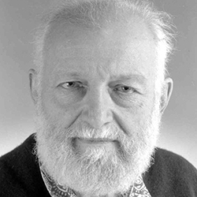
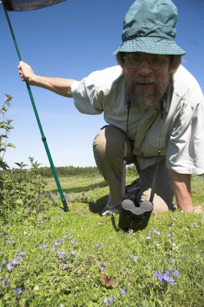

# Metapopulation dynamics on networks

**Lesson plan**:

1. We analyze Levins' metapopulation model, which we've encoutenred before.
1. We introduce the idea of a network of dispersal, and see how metapopulation persistence depends on network structure.
1. We draw a parallel with Susceptible-Infected-Susceptible models, in which individuals play the role of habitable patches and parasites disperse on a network of contacts. 
1. Finally, we discuss recent extensions of metapopulation models including several complications.

## Metapopulations

:::boxhistory

**History: Richard Levins (1930-2016)**

```{r, echo=FALSE,out.width = "35%"}

```

Born in Brooklyn, New York, he studied agriculture and mathematics at Cornell. Early on, influenced by geneticist and polymath Haldane, he became a Marxist activist. Upon graduation, having been blacklisted as a communist (and with the Korean War raging), he moved to Puerto Rico with his wife, and set up a farm. In his spare time, he conducted experiments on fruit flies, organized anti-colonialist rallies and anti-war protests, and taught at the University of Puerto Rico. In 1964, he was invited to Cuba to help organize the biology department of the University of Havana. He received his doctorate from Columbia University in 1965. In 1967 he moved to the University of Chicago, where he joined Richard Lewontin---whith whom he established a lifelong collaboration. They both moved to Harvard in 19XX.

It is impossible to summarize his numerous contributions to ecology, mathematics, political science, and the philosophy of science. He has inspired countless ecologists, and his approach and style are still visible in many of the research programs being carried out today. Of particular interest for this class, his theory of evolution in a changing environment (@levins1968evolution), the development of the idea of limiting similarity (@macarthur1967limiting), his work on metapopulation dynamics (@levins1969some), and the development of Loop Analysis (i.e., a qualitative theory for dynamical systems, @puccia2013qualitative).

:::

:::boxpaper

**Key paper: @levins1966strategy** 

A must read for anyone interested in modeling (in biology and elsewhere). Just two quotes that resonate with the approach taken in these lectures:

* *there are too many parameters to measure; some are still only vaguely defined; many would require a lifetime each for their measurement.*
* *The equations are insoluble analytically and exceed the capacity of even good computers,*
* *Even if soluble, the result expressed in the form of quotients of sums of products of parameters would have no meaning for us.*

$\ldots$

*Therefore, we attempt to treat the same problem with several alternative models each with different simplifications but with a common biological assumption. Then, if these models, despite their different assumptions, lead to similar results we have what we can call a robust theorem which is relatively free of the details of the model. Hence our  truth is the intersection of independent lies.*

:::


## Levins model
## Hanski Ovaskainen 2000

:::boxhistory

**History: Ilkka A. Hanski (1953-2016)**

```{r, echo=FALSE,out.width = "35%"}

```
*Photo by Otso Ovaskainen.*


Born in Lempäälä, Finland, he studied at the University of Helsinki, and received his doctorate from the University of Oxford in 1979. From 1981 to his premature death in 2016, he worked at various Finnish institutions, lastly at the Academy of Finland.

His work on metapopulation theory is extremely well-known, thanks also to the amazing work on the Glanville fritillary butterfly *Melitaea cinxia*. This butterfly inhabits the dry meadows in Åland Islands archipelago---with about 4000 meadows, sampled yearly by an army of students since 1991, the fragmented landscape is an ideal testing ground for metapopulation theory.

Hanski won numerous awards, and served as a strong advocate for ecological conservation.
:::

## SIS on a network Van Mieghem
