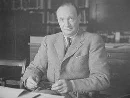

# Quasi-polynomial systems

```{r, include=FALSE}
source("common_settings.R")
```

**Lesson plan**:

1. We discuss a fairly general class of dynamical systems, called "Quasi-Polynomial" (QP-)systems. 
1. We show how any QP-system can be written as a larger-dimensional Generalized Lotka-Volterra model. 
1. This means that the machinery we built for analyzing GLV models can be used to tackle a variety of models that at face value do not seem to fall in this class. We show how to determine global stability in several ecological and epidemiological models using this method.
1. This also shows that the GLV model is in a way a "universal" model.
1. For a simple application, we examine models of metapopulation dynamics with ecosystem engineering.

## Global stability

Many dynamical models describing ecological, epidemiological and evolutionary systems have equilibria that are globally stable (e.g., SIR, SIS, logistic growth, Levins' metapopulation model, MacArthur's consumer-resource model). 

By far, the most powerful method to prove the global stability of an equilibrium is the so-called "Lyapunov direct method", which we've encountered several times already. The main drawback of this method is that devising an appropriate Lyapunov function requires ingenuityand---as @strogatz2018nonlinear put it---a good deal of "divine inspiration". Here we take a different approach: we embed our model of interest into a (possibly larger) GLV model, and then attempt applying the typical Lyapunov function for GLV to our transformed system (an embedding originally proposed by @brenig1988complete). In practice, this will require us to think carefully about how perturbations in the original system translate into the perturbations of the (larger) GLV model.

We first show how systems that are in "Quasi-Polynomial" (QP) form can be embedded into a larger GLV by means of simple matrix operations. Then, we discuss strategies to determine global stability for the embedding. Finally, we show that other models can be turned into QP, and from there into GLV.

## From QP to GLV

We call a Quasi-Polynomial system a system of $n$ ODEs that can be written as:

$$
\frac{d x_i(t)}{d t} = x_i(t) \left(s_i + \sum_{j = i}^m A_{ij} \prod_{k=1}^n x_k(t)^{B_{jk}}\right)
$$

where $s$ is a vector of "growth rates" (not necessarily positive), $A$ is a matrix of interactions, and $B$ a $m \times n$ matrix of exponents. Note that if we take $m = n$ and $B = I_n$ (the identity matrix), we recover the GLV model. If $B$ contains only integers, then we have a polynomial system. Extending this model to real (but not necessarily integer) numbers $B_{jk}$, we have a "Quasi-Polynomial" (QP) system (@hernandez1998algebraic).

In general, we assume that $A$ is of size $n \times m$, $B$ is $m \times n$, and that the $x_i(t)$ are real and positive (if that's not the case, one needs to perform a change of variables that ensures positivity). The system has $n$ variables (the $x_i(t)$), and we can identify $m$ "quasi-monomials":

$$
\prod_{k=1}^n x_k^{B_{jk}}
$$

Several models in ecology and evolution belong to this class. For example, a model that departs from the GLV family is the so-called Leslie-Gower predator-prey model (@leslie1948some):

$$
\begin{cases}
\dfrac{d H}{dt} = H(\rho_h - \alpha_h P - \beta_h H)\\
\dfrac{d P}{dt} = P \left(\rho_p - \alpha_p \dfrac{P}{H} \right)
\end{cases}
$$

The equation for the prey ($H$) is in GLV form. However, the rate of increase (decrease) of the predator depends on the ratio between predators and prey: when prey are abundant, predators grow with rate close to $\rho_p$; if prey are scarce, on the other hand, predators decline. 

:::boxhistory

**History: Patrick H. Leslie (1900-1972)**

```{r, echo=FALSE,out.width = "35%"}

```

Born in Scotland, he studied physiology at Oxford University (Christ Church College). He worked for a few years in the department of pathology, and in 1935 he joined the Bureau of Animal Population, a new center led by Charles Elton. There, he worked on population dynamics mergin theoretical work and applications. 

In 1945 he published in Biometrika his masterpiece, *On the use of matrices in certain population mathematics* (@leslie1945use). In this paper, he developed models for structured populations, which were then extended in several ways, and are still in use today. The so-called Leslie-Gower predator-prey model is developed in a follow-up paper in the same journal (@leslie1948some).

:::

Solving for the coexistence equilibrium, we find:

$$
\begin{cases}
H^\star = \dfrac{\alpha_p \rho_h}{\alpha_p \beta_h + \alpha_h \rho_p}\\
P^\star = \dfrac{\rho_p \rho_h}{\alpha_p \beta_h + \alpha_h \rho_p}
\end{cases}
$$

Note that the model is in QP-form. We recognize three monomials:

$$
\begin{pmatrix}
H\\
P\\
\dfrac{P}{H}
\end{pmatrix}
=
\begin{pmatrix}
H^1 P^0\\
H^0 P^1\\
H^{-1}P^1
\end{pmatrix}
$$

And the associated parameters:

$$
s = (\rho_h, \rho_p) \quad A = \begin{pmatrix} -\beta_h & -\alpha_h & 0\\ 0 & 0 & -\alpha_p \end{pmatrix} \quad B = \begin{pmatrix} 1 & 0 \\ 0 & 1 \\ -1 & 1 \end{pmatrix}
$$

Now we want to turn this models into a Generalized Lotka-Volterra model. We take the new variables to be our monomials:

$$
z = 
\begin{pmatrix}
z_1\\
z_2\\
z_3
\end{pmatrix}
=
\begin{pmatrix}
H^1 P^0\\
H^0 P^1\\
H^{-1}P^1
\end{pmatrix}
$$

and transform the growth rates:

$$
r = \begin{pmatrix}
r_1\\
r_2\\
r_3
\end{pmatrix} = B s = \begin{pmatrix}
\rho_h\\
\rho_p\\
\rho_p - \rho_h
\end{pmatrix}
$$

and the matrix of interactions:

$$
M = B A = \begin{pmatrix}
-\beta_h & -\alpha_h & 0\\
0 & 0 & -\alpha_p\\
\beta_h & \alpha_h & -\alpha_p\
\end{pmatrix}
$$

The GLV system is clearly equivalent (topologically) to the original system, but has now three equations instead of two. Using the transformation $r = Bs$, $M = BA$, we can embed any QP system into a (typically, larger) GLV.

## Stability of GLV

Before proceeding to prove the stability of the coexistence equilibrium for the Leslie-Gower model, we need to revisit the Lyapunov function for the GLV introduced by @goh1977global, which we have encountered before. Take a GLV:

$$
\dfrac{d z}{d t} = D(z)(r + M z) = D(z)(M(z - z^\star)) = D(z)M\Delta z
$$

where $\Delta z$ is a vector of deviations from the equilibrium. Suppose that all species densities remain positive through the dynamics; then, we can write the dynamics of the logarithm of the species densities (where $\log z$ is a vector containing the logarithms of the densities):

$$
\dfrac{d \log z}{d t} = r + M z = M \Delta z
$$

We can take the "candidate Lyapunov function":

$$
V = 1^T D(c)(z - z^\star - D(z^\star) \log (z/z^\star))
$$

where $D(c)$ is a diagonal matrix with positive diagonal coefficients. Deriving w.r.t. time, we find:

$$
\dfrac{dV}{dt} = 1^T D(c) \left( \dfrac{dz}{dt} - D(z^\star) \dfrac{d\log z}{d t} \right)
$$

substituting:

$$
\dfrac{dV}{dt} = 1^T D(c) \left( D(z) M \Delta z  - D(z^\star) M \Delta z \right) = 
1^T D(c) D(\Delta z) M \Delta z
$$

Because diagonal matrices commute (i.e., $D_1 D_2 = D_2 D_1$), we can write:

$$
\dfrac{dV}{dt} = 1^T D(\Delta z) D(c) M \Delta z
$$

Finally, we absorb the $D(\Delta z)$:

$$
\dfrac{dV}{dt} = \Delta z^T D(c) M \Delta z
$$

If a matrix $K$ is negative definite (semi-definite), then $x^T K x < 0$ ($\leq 0$) for any $x \neq 0$. As such, if we were to find a positive definite, diagonal matrix $D(c)$ such that $D(c) M$ is negative semi-definite, we would have proved the global stability of the equilibrium ($V$ is positive whenever $z > 0$  and $z \neq z^\star$, and if $D(c) M$ is negative definite $V$ decreases in time). Because it is typically easier to work with symmetric matrices, w.l.o.g. we can take $K = \frac{1}{2} (D(c)M + M^T D(c))$, which yields exactly the same result: $\Delta z^T D(c) M \Delta z = \Delta z^T K \Delta z$. 

The expression above has been used countless times to prove the stability of GLV models. Note that when our model is indeed a GLV, the $\Delta z_i$ are radially unbounded: $\Delta z_i \in [-z_i^\star, \infty)$ (where the left bound is given by the fact that $z_i$ must be positive). In this case, it therefore makes much sense to try to make $K$ negative definite.

## Stability for GLV embeddings

This is however not the case when our equations have obtained by embedding a lower-dimensional system into a larger GLV. Because we have created new "species" by combining the original species, the perturbations of the "new species" are set by the perturbations of the original species. For example, in the Leslie-Gower embedding we have that $z_3 = P / H = z_2 / z_1$, and therefore:

$$
\Delta z = 
\begin{pmatrix}
\Delta z_1\\
\Delta z_2\\
\Delta z_3
\end{pmatrix} = 
\begin{pmatrix}
\Delta z_1\\
\Delta z_2\\
\dfrac{\Delta z_2 + z_2^\star}{\Delta z_1 + z_1^\star} - \dfrac{z_2^\star}{z_1^\star}
\end{pmatrix} = 
\begin{pmatrix}
\Delta z_1\\
\Delta z_2\\
\dfrac{\Delta z_2 - \dfrac{z_2^\star}{z_1^\star} \Delta z_1}{z_1}
\end{pmatrix} 
$$

showing that the third perturbation is a function of the first two.

Computing the matrix $K$ for this system, we obtain:

$$
K = \frac{1}{2}(D(c) M + M^T D(c)) = \frac{1}{2}
\begin{pmatrix}
-2 c_1 \beta_h & - c_1 \alpha_h & c_3 \beta_h\\
- c_1 \alpha_h & 0 & - c_2\alpha_p + c_3 \alpha_h\\
c_3 \beta_h & - c_2\alpha_p + c_3 \alpha_h & -2 c_3 \alpha_p\
\end{pmatrix}
$$

and taking $\Delta z^T K \Delta z$, we obtain:

$$
\dfrac{dV}{dt} = \Delta z^T K \Delta z = -c_1 \Delta z_1 (\beta_h \Delta z_1 + \alpha_h \Delta z_2) + (c_3 \beta_h \Delta z_1 + (c_3 \alpha_h - c_2\alpha_p)\Delta z_2 )\Delta z_3 - c_3 \alpha_p \Delta z_3^2
$$

Note that the last term is negative for any choice of $c_3 > 0$, which is a good start. We can also make $c_1 = 0$, thereby killing the first term. What remains to be determined is how to handle $(c_3 \beta_h \Delta z_1 + (c_3 \alpha_h - c_2\alpha_p)\Delta z_2 )\Delta z_3$. Because we know that $\Delta z_3$ is a function of $\Delta z_1$ and $\Delta z_2$, we can try to choose appropriate constants to make $(c_3 \beta_h \Delta z_1 + (c_3 \alpha_h - c_2\alpha_p)\Delta z_2 )$ proportional to $-\Delta z_3$, thereby obtaining a function that decreases in time, with form $-\theta \Delta z_3^2$ and $\theta$ positive. 

We have shown above that $-\Delta z_3 \propto \dfrac{z_2^\star}{z_1^\star} \Delta z_1 - \Delta z_2  = \dfrac{\rho_p}{\alpha_p} \Delta z_1 - \Delta z_2$. Take:

$$
(c_3 \beta_h \Delta z_1 + (c_3 \alpha_h - c_2\alpha_p)\Delta z_2 )
$$

extract the term $(c_2\alpha_p - c_3 \alpha_h)$:

$$
(c_2\alpha_p-c_3 \alpha_h)\left(\frac{c_3 \beta_h}{c_2\alpha_p-c_3 \alpha_h} \Delta z_1 - \Delta z_2 \right)
$$

To recover the right form, we need to make $\frac{c_3 \beta_h}{c_2\alpha_p-c_3 \alpha_h} = \frac{\rho_p}{\alpha_p}$. Clearly, there are infinitely many choices. 

A convenient choice is $c_1 = 0$, $c_2 = \alpha_p \beta_h + \alpha_h \rho_p$, and $c_3 = \alpha_p \rho_p$. In this case, we have:

$$
\dfrac{dV}{dt} = -\alpha_p \Delta z_3(\alpha_p \beta_h \Delta z_2 - \beta_h \rho_p \Delta z_1 + \alpha_p \Delta z_3) 
$$

Which can be rewritten as:

$$
\dfrac{dV}{dt} = -\alpha_p^2 (z_1 \beta_h + \rho_p)\Delta z_3^2
$$

which is clearly always negative whenever $\Delta z_3 \neq 0$, given that $z_1>0$ and all parameters are positive. We can write the Lyapunov function directly for the original system:

$$
W = c_2 (P - P^\star - P^\star \log(P/P^\star))+c_3 (P/H - P^\star/H^\star - (P^\star/ H^\star) \log(P H^\star/H P^\star))
$$

yielding:

$$
\dfrac{dW}{dt} = -\dfrac{\rho_p+\beta_h H}{H^2}(\rho_p H - \alpha_p P)^2
$$

which again is negative when we are not at equilibrium, proving global stability.

## Numerical analysis

The derivation above is quite complex, and as always it is easier to find an answer when we know that an answer exists. One of the great advantages of the GLV embedding is that one can quite easily search for the constants numerically. The algorithm is as follows:

- Randomly generate $\Delta z_i$ by choosing random values between 0 and a sufficiently large number (say 10 times their respective equilibria) for each of the original species; from these random numbers, compute the corresponding $\Delta z$ for the new "species";
- Build the matrix $M$;
- For each choice of $D(c)$, compute $K = (1/2)(D(c) M + M^T D(c))$, and then the value of $dV/dt$ for each of the randomly determined $\Delta z$: $dV/dt = \Delta z^T K \Delta z$. 
- If the value is negative for every choice of $\Delta z$, then the constants in $D(c)$ are appropriate; if not, modify $D(c)$, trying to minimize the number of $\Delta z$ leading to a positive result.

For example, this code finds a set of constants for the Leslie-Gower model:

```{r}
set.seed(1)
# choose random parameters 
# (of course the same can be done for specific parameters)
rh <- runif(1)
ah <- runif(1)
bh <- runif(1)
rp <- runif(1)
ap <- runif(1)
# compute equilibria
z1s <- ap * rh / (ap * bh + ah * rp)
z2s <- rp * rh / (ap * bh + ah * rp)
# this is the equilibrium for "z3"
z3s <- z2s / z1s
# now choose random values 
npoints <- 1000
# for each zi
z1 <- runif(npoints, 0, 10 * z1s)
z2 <- runif(npoints, 0, 10 * z2s)
z3 <- z2 / z1
# now compute delta z
deltaZ <- cbind(z1 - z1s, 
                z2 - z2s,
                z3 - z3s)
# compute M
A <- matrix(c(
  -bh, -ah, 0,
  0, 0, -ap), 2, 3, byrow = TRUE)
B <- matrix(c(
  1, 0,
  0, 1,
  -1,1), 3, 2, byrow = TRUE)
M <- B %*% A

# this is the function we want to minimize
LG_to_minimize <- function(const){
  # keep constants positive, and 
  # with mean of 1 (for numerics)
  const <- abs(const) / mean(abs(const))
  Dc <- diag(const)
  K <- (Dc %*% M)
  K <- 0.5 * (K + t(K))
  # now compute dVdt for each deltaZ
  target <- apply(deltaZ, 1, 
                  function(dz) dz %*% K %*% dz)
  # solution found
  if (all(target < 0)) return(-1)
  # otherwise, try to minimize
  return(sum(target[target > 0]))
}

# use optim to find a solution
tmp <- optim(par = runif(3), fn = LG_to_minimize)
if(tmp$value == -1) {
  print("Found a set of constants")
  solution <- tmp$par
  print(round(abs(solution) / mean(abs(solution)),3))
}
```

Which shows that a solution indeed exists. Note that, provided that the choice of $\Delta z$ is extensive enough, the constants found in this way indeed determine the global stability of the equilibrium. Typically, infinitely many choices are possible---but certain choices of constants are better than others, for example allowing for a clean analytical derivation. 

Naturally, the constants we have derived analytically are also appropriate:

```{r}
c1 <- 0
c2 <- ap * bh + ah * rp
c3 <- ap * rp
LG_to_minimize(c(c1, c2, c3))
```

## Systems with many equations

The same type of embedding can help derive Lyapunov functions for systems with many equations. For example, let's examine a MacArthur consumer resource model in which resources are supplied externally. There are $n$ resources, with dynamics:

$$
\dfrac{d x_i}{dt} = k_i - d_i x_i - x_i \sum_j C_{ij} y_j
$$

where $k_i > 0$ is the external input to resource $i$, $d_i \geq 0$ models the degradation of the resource, and $C$ is a matrix containing the consumption rates for the consumers $y_j$.

The dynamics of the consumers are governed by:

$$
\dfrac{dy_i}{dt} = -m_i y_i + y_i \epsilon_i \sum_j C_{ji} x_j
$$

where $m_i > 0$ is the mortality, and for simplicity the transformation efficiency $\epsilon_i > 0$ is set to be predator-specific, but equal for all resources. Our goal is to show that if a feasible coexistence equilibrium exists, it is globally stable.

We rewrite the system in matrix form as:

$$
\begin{cases}
\dfrac{dx}{dt} = D(x)(-d - Cy - D(k)x^{-1}) = D(x)(-d -Cy - D(k)v)\\
\dfrac{dy}{dt} = D(y)(-m + D(\epsilon)C^T x)
\end{cases}
$$

which is a QP system. To higlight the monomials that will give rise to new equations, we have defined $v_i = 1 / x_i$. Using the GLV embedding, we recover a system of $3n$ equations:

$$
s = (-d, -m)^T \quad A = \begin{pmatrix}
0_n & -C & D(k)\\ D(\epsilon) C^T & 0_n & 0_n\end{pmatrix} \quad B = \begin{pmatrix} I_n  & 0_n\\ 0_n & I_n\\ -I_n & 0_n\end{pmatrix}
$$

Where $I_n$ is the $n\times n$ identity matrix, and $0_n$ is an $n \times n$ matrix of zeros. 

The GLV is therefore defined by the vector of growth rates:

$$
r = B s = (-m, -d, m)^T
$$

and the matrix of interactions:

$$
M = B A = \begin{pmatrix}
0_n & -C & D(k)\\
D(\epsilon) C^T & 0_n & 0_n\\
0_n & C & -D(k)
\end{pmatrix}
$$

Now compute $K$; taking as constants $c = (1_n, \epsilon^{-1}, 0_n)$ makes $K$ very sparse:

$$
K = \frac{1}{2}(D(c)M + M^T D(c)) = \frac{1}{2}\begin{pmatrix}
0_n & 0_n & D(k)\\
0_n & 0_n & 0_n \\
D(k) & 0_n & 0_n
\end{pmatrix}
$$

Now define $z = (x, y, v)^T$, and compute $dV/dt$:

$$
\dfrac{dV}{dt} = \Delta x^T D(k) \Delta v
$$

Finally, notice that $v = 1/x$, and therefore:

$$
\Delta v_i = \dfrac{1}{x_i} - \dfrac{1}{x_i^\star} = \dfrac{1}{\Delta x_i + x_i^\star} - \dfrac{1}{x_i^\star} = -\dfrac{\Delta x_i}{x_i^\star x_i}
$$

This proves the stability of the equilibrium, given that 

$$
\dfrac{dV}{dt} = \Delta x^T D(k) \Delta v = -D(k) \dfrac{\Delta x^2}{x^\star x}
$$

## GLV embedding for non-QP systems

Finally, we consider a simple case in which the original system is not already in QP form. Consider a very simple model for facultative mutualism:

$$
\begin{cases}
\dfrac{dx_1}{dt} = x_1(1 - x_1 + \alpha \dfrac{x_2}{1+x_2})\\
\dfrac{dx_2}{dt} = x_2(1 - x_2 + \alpha \dfrac{x_1}{1+x_1})
\end{cases}
$$

In the absence of the mutualist, each species grows logistically. However, they can coexist at higher abundance--though the beneficial effect eventually saturates. Again, our task is to prove the global stability of the coexistence equilibrium.

This model is not in QP form. To turn it into QP form, we need to define $v_1 = x_1 / (1 + x_1)$ and $v_2 = x_2 / (1+x_2)$. We write two new equations for $v_1$ and $v_2$, resulting in a system of four equations:

$$
\begin{cases}
\dfrac{dx_1}{dt} = x_1(1 - x_1 + \alpha v_2)\\
\dfrac{dx_2}{dt} = x_2(1 - x_2 + \alpha v_1)\\
\dfrac{dv_1}{dt} = v_1(1 - 2 v_1 + \alpha v_2 - \alpha v_1 v_2)\\
\dfrac{dv_2}{dt} = v_2(1 - 2 v_2 + \alpha v_1 - \alpha v_1 v_2)\\
\end{cases}
$$

which is in QP form. Now we can perform the GLV embedding, resulting in a new equation for $p = v_1 v_2$:

$$
z = (x_1, x_2, v_1, v_2, p)^T
$$
$$
s = (1,1,1,1)^T \quad A = \begin{pmatrix} 
-1 & 0 & 0 & \alpha & 0\\
0 & -1 & \alpha & 0 & 0\\
0 & 0 & -2 & \alpha &-\alpha\\
0 & 0 & \alpha &-2 & -\alpha\\
\end{pmatrix} \quad B = \begin{pmatrix}
1 & 0 & 0 & 0\\
0 & 1 & 0 & 0\\
0 & 0 & 1 & 0\\
0 & 0 & 0 & 1\\
0 & 0 & 1 & 1\\
\end{pmatrix}
$$


FINISH THIS

:::boxhomework

**Homework 9**

METAPOP

:::
